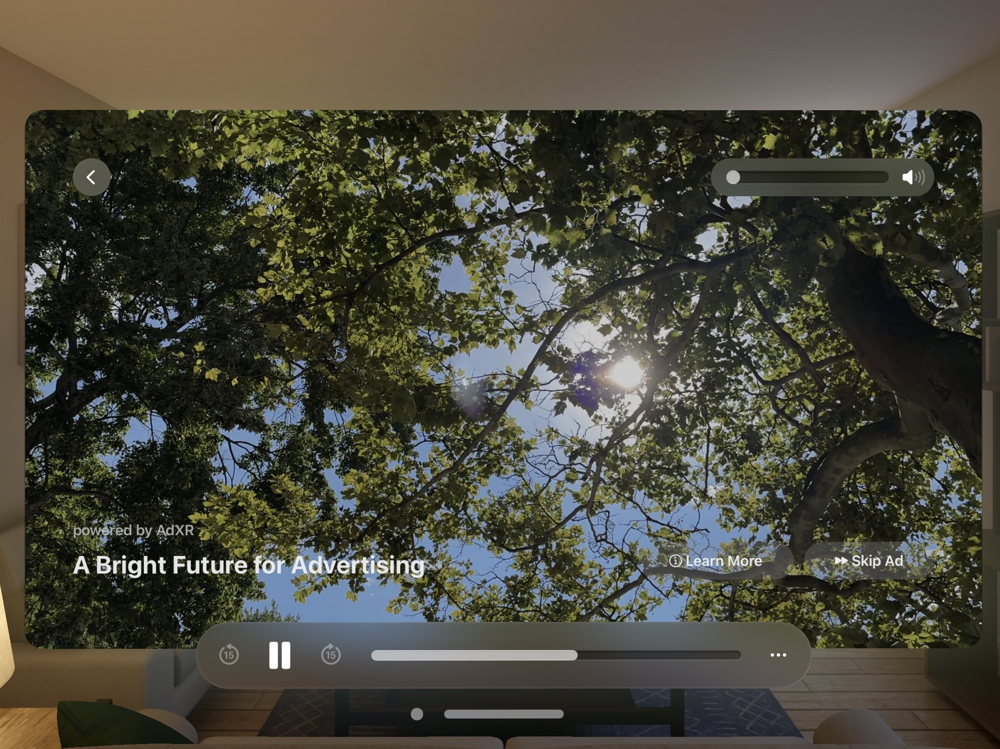

 

  Wild, free-ranging skepticism. That was my first reaction when someone suggested I put ads in our Vision Pro app, [Passage](https://apps.apple.com/us/app/flowriter-writers-retreat/id6470159510).

They had made an ad network on Vision Pro, built from the ground up. They made a good case for [AdXR.io](https://www.adxr.io). They had a good set of [principles](https://www.adxr.io/vision). Beautiful ads. Non-invasive (they don’t even ask for app tracking permission). Reminds me more of a brand marketing approach, instead of the tracked impressions fest that has wrecked web and early mobile apps.

Still, ads in Vision Pro? I’ve seen the dystopian visions of ads in AR. You’re walking down the street and ads are popping up everywhere, vying for your attention. That one Minority Report scene come to life, where stores are reading eyeballs and pushing products. So I took a meeting, thought, that’s interesting, and left it at that.

**A respite from subscription fatigue**

Then, using Passage and thinking about business models that work on Vision Pro, I had some insight. I thought of a way to incorporate ads in a respectful way, and more importantly, I found a precise reason to insert ads: subscription fatigue.

Passage is a subscription app. It’s this way, in no small part, because a large portion of the app lets people generate their own immersive spaces via AI-created spherical images. We also have human photographer created images, and you can upload your own, but the main cost to us as developers, other than maintaining and improving the app, is the cost of the APIs we use to generate their images. 

So subscription pricing is a very good fit. And it’s still in the app.

However, subscription fatigue is also very real. Sometimes, taking a little bit of time and making that clean trade (especially where there isn’t data mining going on), is an honest exchange. Some customers might be heavier users where a subscription is a better fit. Ads, however, opens it up to more people.

Our solution then, was this: if you wanted to use a premium feature, you can use it after you see an ad, or you can subscribe.

**Knowing when and how to show ads**

However, we don’t pop up the ads. Throughout the app we’ve made clear that you can make a choice: subscribe or see the ad. So you’re never surprised by a feature you didn’t know was premium so you’ve got to see the ad. And you’re not caught off guard if you’re in the middle of something. No popups, no surprises.

We also don’t show ads at every juncture. The first time you visit a place, it’s on us. No ad, no free trial requirement, no nothing. If you hide a place and then show it again, no ad there. If you want to go between images you’ve already uploaded, or images you’ve already generated, no ads there either. No sense in overloading these when you want to get work done.

What’s more, you understandably wait under a minute for the generation feature anyway, so the advertisement does not necessarily intrude on that portion of the experience.

**Into the unknown**

Thus we’ve added the ads. The company AdXR aims to work only with high quality apps, so we’re glad to have been selected, and you can reach out them directly to see if you’re eligible. I leave the coveted details of price per impression and such to them.

The ads themselves fit with the platform. They’re spatial video at the moment. (You could imagine other cool scenarios: 3D swag you can download, advertising in volume spaces, and so forth). And they use native controls.

This platform though, represents a fresh start in advertising. And hopefully it can be something sustainable for AR/VR/XR creators and developers.