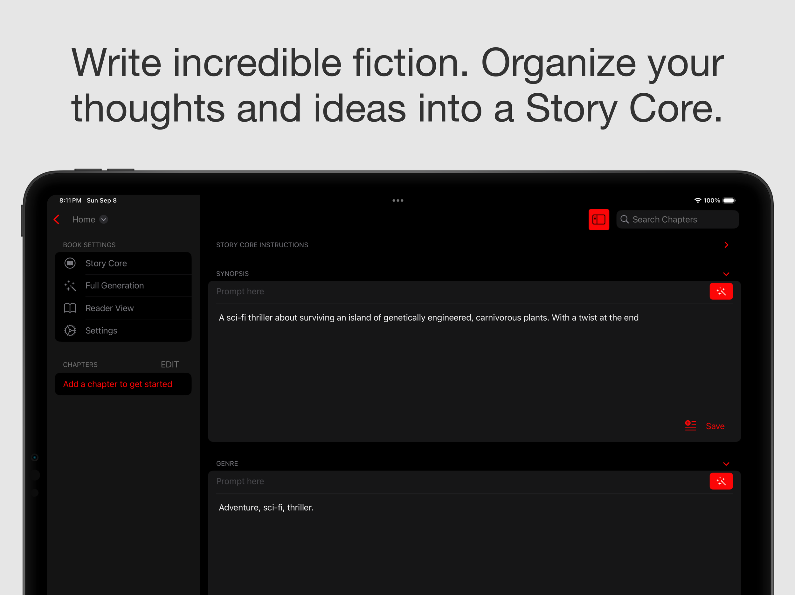
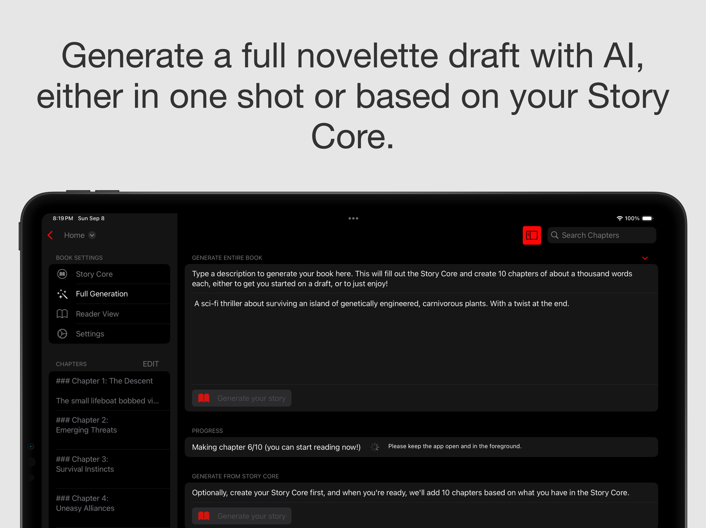
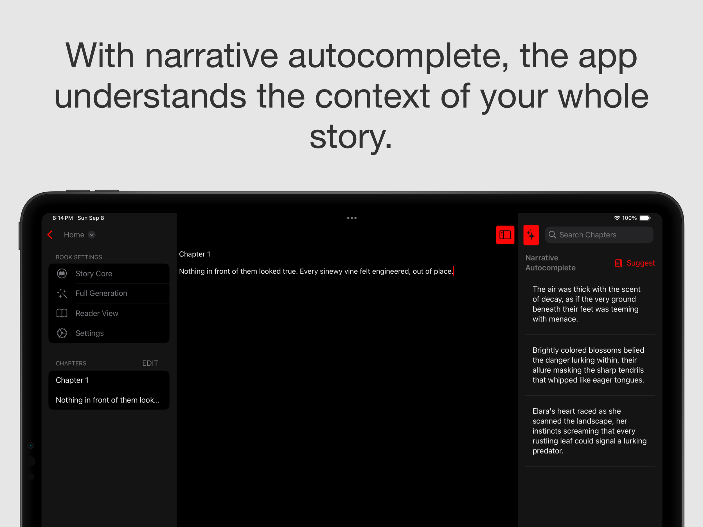
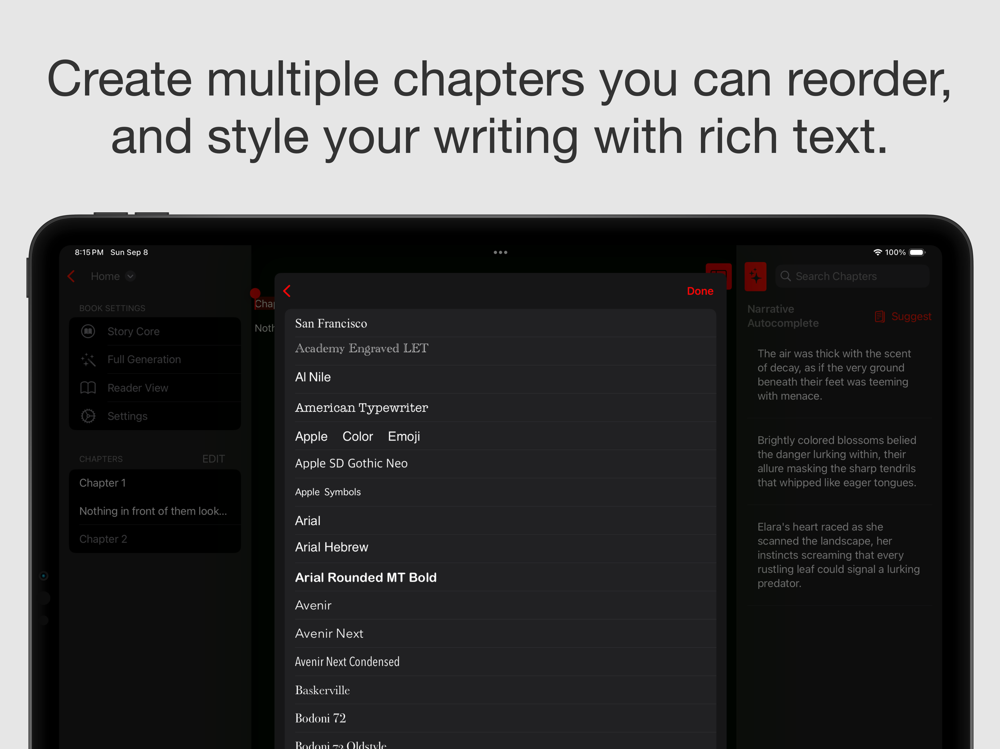
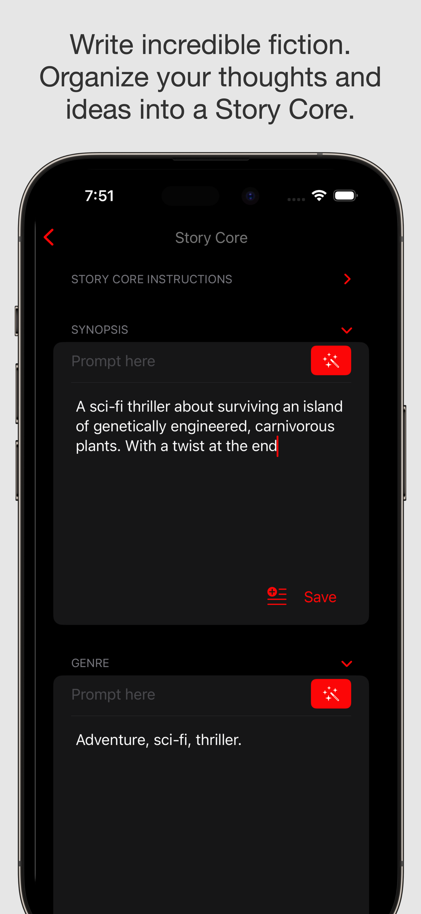
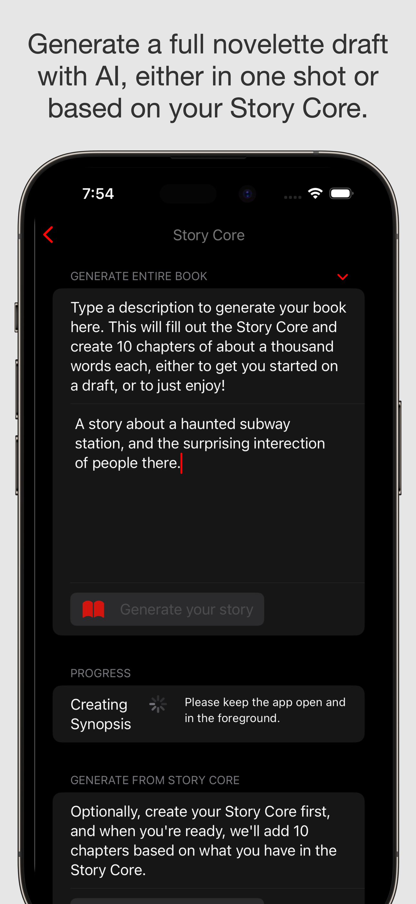
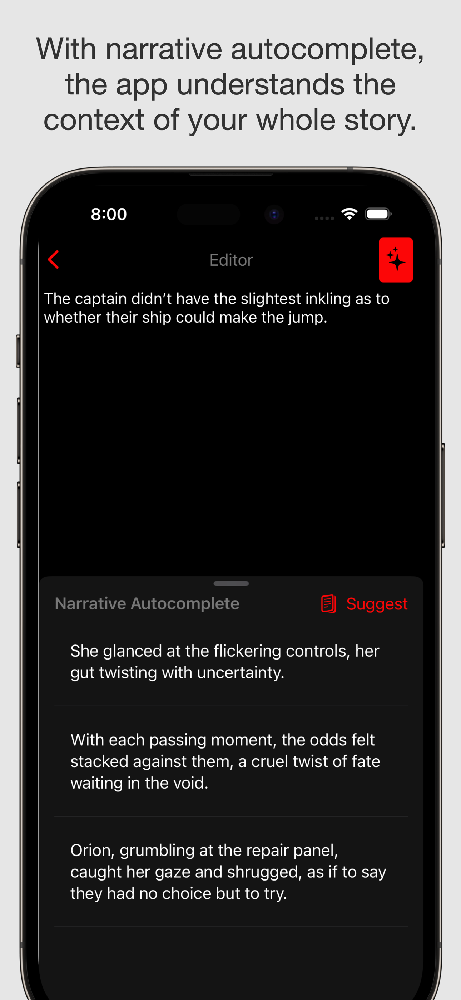
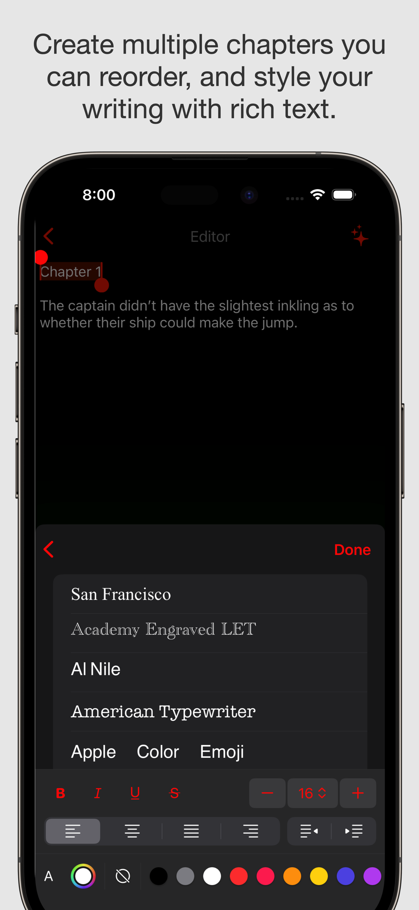
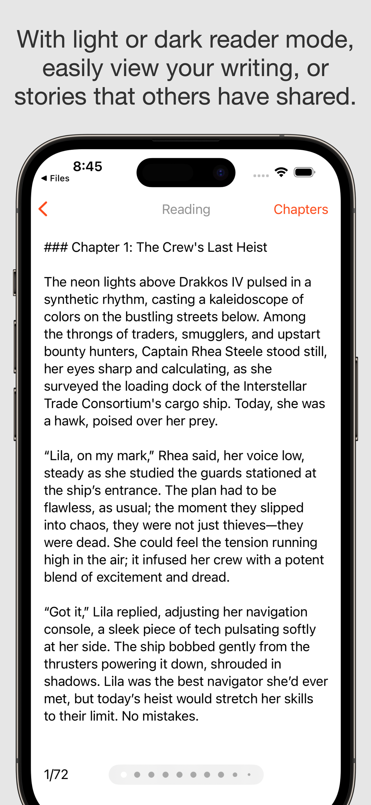

This app will not generate groundbreaking art. But you might.

The writing tool - [which you can get here](https://apps.apple.com/us/app/writing-app-ember-glow/id6584513293) - helps people write incredible fiction. We call it Ember Glow to evoke telling stories around a campfire and represent a kindling of creativity. 

The app has a slew of AI-focused features, all of which are optional. I very much enjoy writing creative fiction (I have a couple of unpublished novels under my belt). Often I have an extremely specific vision and mull over every word, and have no desire to use AI at all. And sometimes I just want to play around with story concepts and see different versions of AI fleshing out story outlines and characters, with me often taking it in an entirely different direction, but it was nice to get the juices flowing. And other times I just have AI generate an entire story for fun to see where things fall.

In the end, I want to respect writers who just want to write, no AI bells and whistles, but also creatives who want to explore and tinker with AI for themselves. So we have three levels (see them after the images, we worked hard to get a nice iPad version going, which for M-series Macs, will also work there!):

  
  

  
   
  

  
   
  

  
   
  

  
   
  

  
#### AI Level 1: None                     

Even with no AI at all, you get (free):

- An outline you can fill out to brainstorm and keep track of your thoughts, the Story Core. There you fill out the list of characters, the plot outline, world building, and so on.

- A fully-featured rich text editor.

- A nice reader mode that picks up where you left off, divides your work into pages and let’s you jump quickly to chapters

- The ability to transform your book into a PDF.

- Organization of your work into chapters that you can rearrange.

- You can remove the sidebars on iPad for a focused, full-screen writing experience.

- You can store your books anywhere: on your device, in the cloud, you can share them with others, and others can share them with you in a file type made for the app.

#### AI Level 2: Some

Each section of the Story Core lets you provide a prompt where to generate that portion of the core. And it's all editable afterwards.

You also get a section of the app that provides narrative autocomplete, meaning the app understands the whole context of all you have written, including the Story Core and summaries of your writing thus far, to help unblock you or give you ideas of what to write (or if you will, use them as ideas of what not to write; going against all the generative suggestions is very much an option).

#### AI Level 3: Full

Here we generate 10-chapter novelette. They're meant for you to either enjoy on your own, or to flesh out into a richer story. They're not meant for spamming publishers, in other words. 

You can either create the novelette from a single description, or you can fill out your story core first and generate it that way.

#### Enjoy!

If nothing else, I hope this app encourages you to write, to kick start your creativity, and get to telling your story.

  
  

  
   
  

  
   
  

  
   
  

  
   
  

  
   