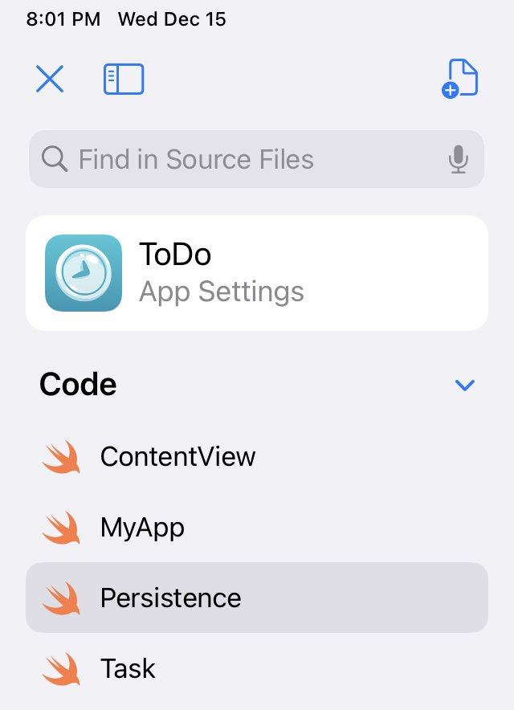

Happy Swift Playgrounds day! If you haven’t heard, you can now [write apps on your iPad](https://developer.apple.com/news/?id=v868vy6e).

It’s very full featured, but one thing that you might need to do a little extra work on is persistence. Can you use CoreData, for instance? The answer, is, mostly, yes.

For instance, we can get the basics of a CoreData ToDo list running quickly. You can see me cross off and uncross off tasks in the preview below and to the right.

A video of a ToDo app made with CoreData and SwiftUI on Playgrounds.

  To the code!

First off, so much of this is thanks to the work [made in this blog post](https://www.atomicbird.com/blog/core-data-code-only/) on creating CoreData models without the special, graphical model constructor. So if you have more questions about creating relationships between multiple entities, that’s a good place to go.

For our use, we’ll just use on object, a Task (and I should probably rename that considering all the new async feature naming with TaskGroup and such).

Here are all the files I have:

        

  Here is the first file. My model of Task

```
`import CoreData
import SwiftUI

@objc(Task)
class Task: NSManagedObject {
    @NSManaged var complete: Bool
    @NSManaged var name: String?
    @NSManaged var index: Int
}

extension Task: Identifiable {
    var id: Int {
        index
    }
}`
```

  And now that I have that, I can create my Persistence layer like so:

```
`import CoreData
import SwiftUI

class Persistence {
    static let shared = Persistence()

    static let previewFull: Persistence = {
        let result = Persistence(inMemory: true)
        let context = result.container.viewContext
        for index in 0 ..< 5 {
            let task = Task(context: context)
            task.name = "Task \(index + 1)"
            task.complete = false
            task.index = index

            context.perform {
                try! context.save()
            }
        }
        return result
    }()

    let container: NSPersistentContainer

    init(inMemory: Bool = false) {
        let taskEntity = NSEntityDescription()
        taskEntity.name = "Task"
        taskEntity.managedObjectClassName = "Task"

        let nameAttribute = NSAttributeDescription()
        nameAttribute.name = "name"
        nameAttribute.type = .string
        taskEntity.properties.append(nameAttribute)

        let completeAttribute = NSAttributeDescription()
        completeAttribute.name = "complete"
        completeAttribute.type = .boolean
        taskEntity.properties.append(completeAttribute)

        let indexAttribute = NSAttributeDescription()
        indexAttribute.name = "index"
        indexAttribute.type = .integer64
        taskEntity.properties.append(indexAttribute)

        let model = NSManagedObjectModel()
        model.entities = [taskEntity]

        let container = NSPersistentContainer(name: "TaskModel", managedObjectModel: model)

        if inMemory {
            container.persistentStoreDescriptions.first!.url = URL(fileURLWithPath: "/dev/null")
        }

        container.loadPersistentStores { description, error in
            if let error = error {
                fatalError("failed with: \(error.localizedDescription)")
            }
        }

        container.viewContext.mergePolicy = NSMergeByPropertyObjectTrumpMergePolicy

        container.viewContext.automaticallyMergesChangesFromParent = true
        self.container = container
    }
}`
```

  You’ll notice that we just needed to specify a bunch of attributes manually for our object, instead of using the graphical interface we have available in Xcode.

And I’ve created a preview version of Persistence to have some starter dummy data.

Then we can create our app like this:

```
`import SwiftUI

@main
struct MyApp: App {
    let persistence = Persistence.previewFull
    var body: some Scene {
        WindowGroup {
            ContentView()
                .environment(\.managedObjectContext, persistence.container.viewContext)
        }
    }
}`
```

  And our view is this:

```
`import SwiftUI

struct ContentView: View {
    @Environment(\.managedObjectContext) private var viewContext

    @FetchRequest(sortDescriptors: [
        NSSortDescriptor(keyPath: \Task.index, ascending: true)
    ], animation: .default)
    private var items: FetchedResults<Task>

    var body: some View {
        List(items) { item in
            VStack {
                if !item.complete {
                    Text(item.name ?? "Unknown")
                } else {
                    Text(item.name ?? "Unknown")
                        .strikethrough()
                    }
            }
            .onTapGesture {
                    viewContext.perform {
                        item.complete.toggle()
                        try! viewContext.save()
                    }
                }
        }
    }
}`
```

  From there you can move forward with CoreData in SwiftUI as you would elsewhere, and we’re off and running!

#### Quick Limitation

I like to use all of the automagicalness of CloudKit when I’m working with CoreData, and at least with iPad alone, there isn’t a way to do all of that, so you’ll need to code up your own syncing solution as well if you want that. Both CloudKit entitlements and push notifications [Correction: it seems that local notifications are working, so remote push notifications may well be working too!] are absent from the capabilities you can give your app.

Let me know if you find ways around that, and checkout [my app Pearl: Wellness Reminders](https://apps.apple.com/us/app/pearl-wellness-reminders/id1567837432), which does in fact contain that CloudKit/CoreData syncing goodness, just not via the iPad yet!