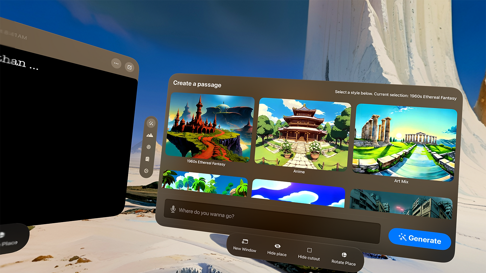

**Update: ***After this post was written, Apple wrote their own example and tutorial to make a skybox and fully 3D environment like the system environments. See it at the end!*

My co-developer Abe and I really loved the idea of using AI to create immersive worlds. It's a vision that eventually led us to the creation of Passage, an app to be immersed in play or productivity in worlds that you create with generative AI. I have enough experience in image generation to roll my own machine learning pipeline, but when we used [the API from Blockade Labs](https://skybox.blockadelabs.com/api-membership), we were hooked. We could focus on the particular experience of delivering the wonder of Passage without a massive investment in cloud architecture and ML resources.

> *Glorious 8K. Incredibly detailed images that look crisp in the Vision Pro.*

Early on, I tested the API’s images in the Quest 2. Looking good. We even had the chance to demo in Apple’s developer labs. I’ll admit, the quality early on in the Vision Pro wasn’t where I wanted it, but it was close enough that, even though it wasn’t the ideal resolution (6k instead of 8k, and early days of image generation), we enjoyed coming up with fantastic locations that it was still worthwhile to use. And now, with the newest version of the API, we’ve arrived. Glorious 8K. Incredibly detailed images that look crisp in the Vision Pro. We were privileged enough to closely test images during Blockade Labs’ development process, and it’s wild how well they’ve turned out.

How did we do it though? What are the steps of integrating this kind of immersive and generative experience in your own apps?

## **Step 1: You want a server**

Just a little relay server. That will keep your Blockade Labs API key safe from web proxies sniffing or decompilers sifting through your code. And it gives you more control over your business model. 

We were able to integrate with Revenue Cat to make sure the users pinging our API have a subscription through us, and the server gives us the chance to decouple API changes from our app, allowing for quick iteration. Seriously, we’re over here using a simple Swift Vapor server and it rocks.

  
  

  
      
  

  
## **Step 2: The skybox**

There isn’t a great way in Reality Composer Pro to really turn a sphere inside out, which is what you need to do to make a skybox. If you look carefully at Apple’s source code for [their outer space sample code](https://developer.apple.com/documentation/visionos/world) and [their immersive video sample code](https://developer.apple.com/documentation/visionos/destination-video), you find that the trick is to make the x scale by -1.

Here is the entirety of the Starfield.swift example from the Hello World sample app:

  
  

```
`import SwiftUI
import RealityKit
/// A large sphere that has an image of the night sky on its inner surface.
///
/// When centered on the viewer, this entity creates the illusion of floating
/// in space.
struct Starfield: View {
    var body: some View {
        RealityView { content in
            // Create a material with a star field on it.
            guard let resource = try? await TextureResource(named: "Starfield") else {
                // If the asset isn't available, something is wrong with the app.
                fatalError("Unable to load starfield texture.")
            }
            var material = UnlitMaterial()
            material.color = .init(texture: .init(resource))
            // Attach the material to a large sphere.
            let entity = Entity()
            entity.components.set(ModelComponent(
                mesh: .generateSphere(radius: 1000),
                materials: [material]
            ))
            // Ensure the texture image points inward at the viewer.
            entity.scale *= .init(x: -1, y: 1, z: 1)
            content.add(entity)
        }
    }
}`
```

  And there you have it. Make a super big sphere, flip it inside out by multiplying the scale and you’re done!

## **Step 3: User comfort stepping in and out of worlds**

We gave our users two versions: one with progressive immersion that works just like the default environments, controlling immersion with a dial, and another where you can be fully immersed with a cutout to see your desk/keyboard/mug. 

We started with a focus on writing and productivity, since immersion for immersion’s sake only goes so far. We want to give people things to do in these wild worlds, so seeing the keyboard and desk was key to anchoring people in. To do that, we couldn’t use full immersion, because the passthrough is blacked out. We therefore used the mixed style of immersion. However, if you make an immersive skybox with mixed immersion, you want to make it so that if people get up and walk around, the skybox fades away, so that they don’t bump into things. That’s how we care for our user’s comfort.

We set to work and built a custom shader so that, when the user moves too far from the starting point, the world disappears. You can get a reference to the user’s distance from an object right in the shader itself when using Reality Composer Pro.  By the way, there are great resources on working with shaders in Reality Composer Pro.

- This article from Apple explains [how to use materials in Reality Composer Pro](https://developer.apple.com/videos/play/wwdc2023/10202/)

- This fun video shows [how to create a gradient shader](https://www.youtube.com/watch?v=KVyomXuaR7g)

- And this article shows [how to make a node-based shader](https://medium.com/@mrdeerwhale/getting-started-with-node-based-shaders-for-visionos-materials-7f901177567c)

## **Miscellaneous tips when working with the Blockade Labs API**

1. Use. The. Styles. At first I was just making images by giving extremely long prompts and hoping for the best. Like the early days of Midjourney and Stable Diffusion. The best results though, are using the styles that the Blockade Labs crew are tirelessly working to perfect. Those have been, by far, the best results.

1. You’ll need to use [pusher websocket swift](https://github.com/pusher/pusher-websocket-swift) to get updates about when your Skybox is ready. It’s fairly straightforward, but essentially you’ll send a request to your relay server, your relay server will forward you image request to Blockade Labs, and then Blockade Labs will give you a Pusher Channels URL. Then you get a response when it’s ready with the URL of your desired image.

1. Pro tip: give users a way to change your view. This is something we did early on with gestures. When you set the skybox, you might not be giving your user the best view. Let them drag or rearrange the skybox so that they can have the most interesting vista in their line of sight.

There you have it. Glad to have worked with the Blockade Labs crew and really excited about where our app is going. We now have a built in browser in our app so that you can watch sci fi movies in a sci-fi movie you generate, listen to music in a meditative space you create, or work on productivity and design tools accessible on the web in a focused, or inspiring environment. Have a great time, and give [Passage](https://apps.apple.com/us/app/id6470159510) a try!

## Update, tutorial from Apple

Apple recently released [an entire tutorial and sample project on creating a 3D environment](https://developer.apple.com/documentation/realitykit/construct-an-immersive-environment-for-visionos?changes=_3___1_5,_3___1_5&language=objc,objcDoes). It dives deep into different ways of creating the skybox (making a half dome with normals pointing inward), and a bunch of efficiency tips. It’s well worth the read and giving it a run. It even shows that they’re animating a pool of water. Now we just hope that we can soon get some sort of access to system environments, to make these custom environments really take off, or have a way to at least have a mixed immersive mode where you can use other apps in your immersive environment. I mean, we have plenty for users to do in our app: hang out with friends in SharePlay, an offline, rich text editor and even a mini-browser, all multi-window. But still. Fingers crossed!