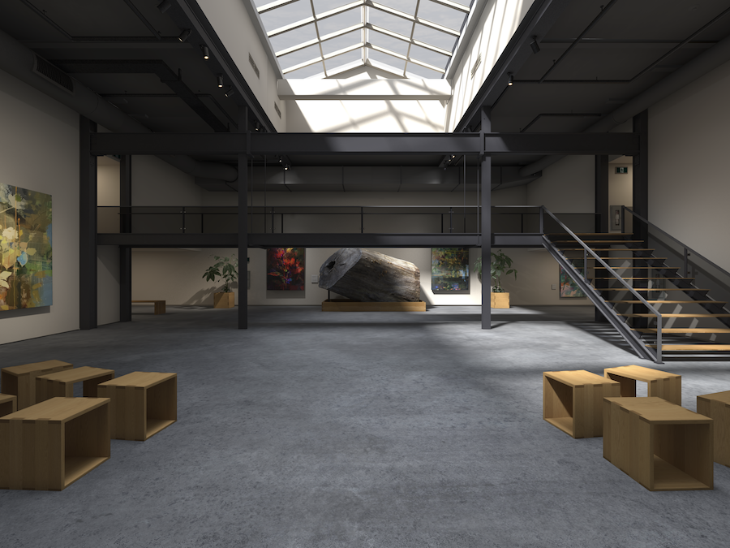

  

  Finally. [Passage goes 3D](https://apps.apple.com/us/app/flowriter-writers-retreat/id6470159510)

Our app has let you enjoy immersive environments in a few ways:

1. Check out the artist-made 360 images that we’ve licensed.

1. Upload your own 360 image, up to 16k

1. Create a 360 image with AI.

(In these worlds, you can get work done or watch video in an in-app browser, use our document setup for writing, or even[ bring your Mac desktop in](/blog/seeing-your-mac-in-3rd-party-immersive-apps-on-the-vision-pro) for any other kind of work)

Now we have a new one: actual 3D places.

### Learning the ropes

Under the hood they are USDZs, the file format pioneered by Pixar, and compressed by Apple, and even advanced by NVIDIA (at least USDs). We borrowed a lot from Apple’s own work in demonstration projects: there is a light version of a studio, a dark version of the same studio, a low-poly glen that has its own animated water, and then various 3D environments that we purchased.

Admittedly, the best ones are Apple’s own work. And we’re still in the process of learning how to make our own from scratch, but dang, as AI/ML programmers and iOS developers, there is a lot of knowledge to catch up on (apropos of nothing, if you’re a 3D professional, reach out to us if you think you can make a really cool 3D world that can be packaged into a reasonably sized USDZ; we have a modest budget!)

There is still further to go in true 3D: giving people a way to move around in the world for instance. You can already rotate the world to your preferred location, and that’s true for all our environments, but yeah, allowing folks to wander, i.e. movement translation, is high up on our list of priorities.

We’ve learned a lot.

(Just a fun tip, if you're downloading something like a USDZ, load it as an Entity, rather than a ModelEntity, and you can get more things from your scene. What I mean is, we were able to add particle effects as clouds, in Reality Composer Pro, and export it as a USDZ, and to my surprise, they were right there in the exported USDZ! But then we tried to import it into the scene from a remote file, and We didn't see the clouds or anything. But then we loaded it as an Entity instead of a ModelEntity, and boom! There they were.)

### More to come

What is fun is how much there is to explore in terms of both AI for 3D worlds, and 3D scanning to bring bits of the real world in, and ML techniques like gaussian splatting to make the environments. We hope folks will enjoy the places we’ve added. Some are a bit better than others, granted, but we want to make this 3D spaces as high quality as we can manage, and bring plenty of joy to the folks who use our app.