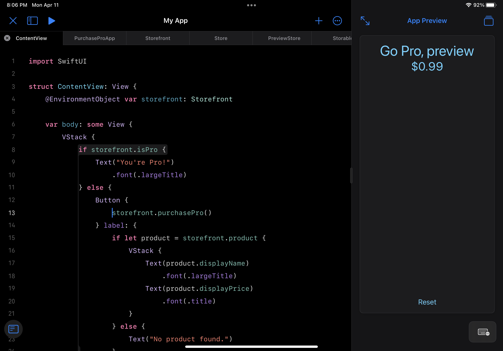
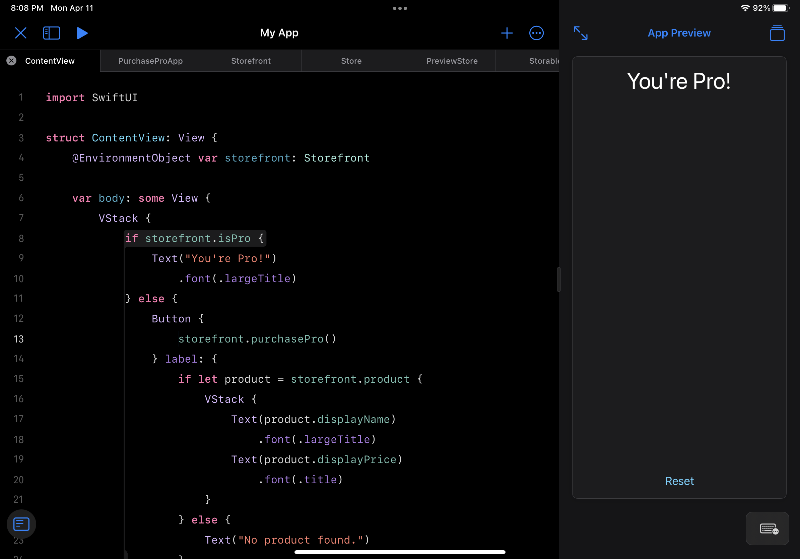
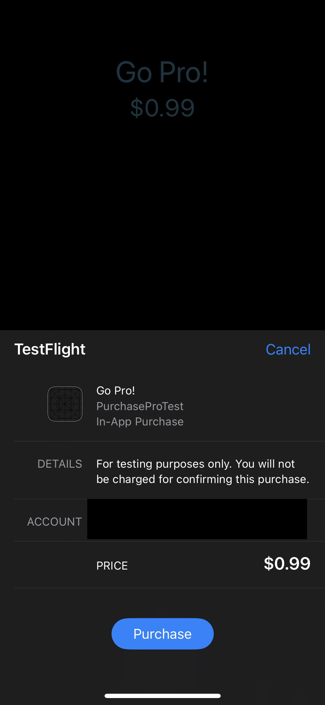

I figured out how to make in-app purchases work when making apps with Swift Playgrounds on iPad, and I wanted to share with you, not only the basics, but also the ability to make the code testable on device.

The reason being, your in-app purchases won’t work at first!

By which I mean, the code only becomes fully functional after you upload it to TestFlight, so you’ll want a way to test purchase flows and such without going through that whole process for sure.

On to the code (which by the way, can help with regular Xcode purchasing too in all of it’s async/await goodness!).

### The basic Store.swift

This is the code I use to get my store up and running. It’s a riff on Apple’s example, but a big more generic so that you can reuse it across your apps. Almost a framework or Swift package, but it’s too small to make it an official repo and I’m a very lazy man.

  
  

```
`import Foundation
import Combine
import StoreKit

typealias Transaction = StoreKit.Transaction
typealias RenewalInfo = StoreKit.Product.SubscriptionInfo.RenewalInfo
typealias RenewalState = StoreKit.Product.SubscriptionInfo.RenewalState

public enum StoreError: Error {
    case failedVerification
}

class Store {
    static let shared = Store(productIds: [])
    private(set) var nonConsumables: [Product] = []
    private(set) var consumables: [Product] = []
    private(set) var subscriptions: [Product] = []
    var purchasedIdentifiers = Set<String>() 

    var updateListenerTask: Task<Void, Error>? = nil

    private let productIds: [String]

    init(productIds: [String]) {
        self.productIds = productIds

        //Start a transaction listener as close to app launch as possible so you don't miss any transactions.
        updateListenerTask = listenForTransactionsThatHappenedOutsideTheApp()
    }

    deinit {
        updateListenerTask?.cancel()
    }

    func listenForTransactionsThatHappenedOutsideTheApp() -> Task<Void, Error> {
        return Task.detached {
            for await result in Transaction.updates {
                do {
                    let transaction = try self.checkVerified(result)
                    await self.updatePurchasedIdentifiers(transaction)

                    //Always finish a transaction.
                    await transaction.finish()
                } catch {
                    //StoreKit has a receipt it can read but it failed verification. Don't deliver content to the user.
                }
            }
        }
    }

    func requestProducts() async {
        do {
            let storeProducts = try await Product.products(for: productIds)
            var newNonConsumables: [Product] = []
            var newSubscriptions: [Product] = []
            var newConsumables: [Product] = []

            for product in storeProducts {
                switch product.type {
                case .consumable:
                    newConsumables.append(product)
                case .nonConsumable:
                    newNonConsumables.append(product)
                case .autoRenewable:
                    newSubscriptions.append(product)
                default:
                    break
                }
            }

            nonConsumables = sortByPrice(newNonConsumables)
            subscriptions = sortByPrice(newSubscriptions)
            consumables = sortByPrice(newConsumables)
        } catch {
            // Handle error here.
        }
    }

    func purchase(_ product: Product?) async throws -> Transaction? {
        guard let result = try? await product?.purchase() else {
            return nil
        }

        switch result {
        case .success(let verification):
            let transaction = try checkVerified(verification)
            await updatePurchasedIdentifiers(transaction)
            await transaction.finish()
            return transaction
        case .userCancelled, .pending:
            return nil
        default:
            return nil
        }
    }

    func isPurchased(_ productIdentifier: String) async throws -> Bool {
        guard let result = await Transaction.latest(for: productIdentifier) else {
            return false
        }

        let transaction = try checkVerified(result)

        //Ignore revoked transactions, they're no longer purchased.
        //For subscriptions, a user can upgrade in the middle of their subscription period. The lower service
        //tier will then have the `isUpgraded` flag set and there will be a new transaction for the higher service
        //tier. Ignore the lower service tier transactions which have been upgraded.
        return transaction.revocationDate == nil && !transaction.isUpgraded
    }

    func checkVerified<T>(_ result: VerificationResult<T>) throws -> T {
        switch result {
        case .unverified:
            //StoreKit has parsed the JWS but failed verification. Don't deliver content to the user.
            throw StoreError.failedVerification
        case .verified(let safe):
            return safe
        }
    }

    func updatePurchasedIdentifiers(_ transaction: Transaction) async {
        if transaction.revocationDate == nil {
            purchasedIdentifiers.insert(transaction.productID)
        } else {
            purchasedIdentifiers.remove(transaction.productID)
        }
    }

    func sortByPrice(_ products: [Product]) -> [Product] {
        products.sorted(by: { return $0.price < $1.price })
    }

    func restorePurchases() {
        Task {
            try? await AppStore.sync()
        }
    }
}`
```

  With that code you can get started on [subscriptions, consumables, and non-consumables](https://developer.apple.com/in-app-purchase/).

However, you probably also want a way to test purchases without needing to upload the app to TestFlight each time you make a change. For that you can make an intermediary layer that can use either a debugging/preview version of the store, or the actual production version of the store. So let’s get our protocols and PreviewStore ready.

  
  

```
`import StoreKit

protocol Storable {
    func requestProducts() async
    var nonconsumableProducts: [Productable] { get }
    /// You could add other products here, consumables, subscriptions, etc.
    @MainActor func purchase(_ product: Productable?) async throws -> Bool
    func isPurchased(_ productIdentifier: String) async throws -> Bool
}

extension Store: Storable {

    var nonconsumableProducts: [Productable] {
        nonConsumables
    }

    @MainActor
    func purchase(_ product: Productable?) async throws -> Bool {
        if let product = product as? Product {
            return try await purchase(product) != nil
        }

        return false
    }
}

import StoreKit

class PreviewStore: Storable {
    var madePurchase = false
    var nonconsumableProducts: [Productable] =
        [
            PreviewProduct(id: "com.CephalopodStudio.PurchasePro.GoPro", 
                           displayName: "Go Pro, preview", 
                           displayPrice: "$0.99")
        ]

    private var transactions: [Transactionable] = [
        PreviewTransaction(productID: "com.CephalopodStudio.PurchasePro.GoPro"),
    ]

    @MainActor
    func purchase(_ product: Productable?) async throws -> Bool {
        guard let product = product else {
            return false
        }

        let transaction = transactions.first { 
            $0.productID == product.id
        }

        madePurchase = true

        return transaction != nil
    }

    func requestProducts() async { }

    func getProduct(forId id: String) async -> Transactionable? {
        let transaction = transactions.first { 
            $0.productID == id
        }

        return transaction
    }

    func isPurchased(_ productIdentifier: String) async throws -> Bool {
        return madePurchase
    }
}

struct PreviewProduct: Productable {
    var id: String
    var displayName: String
    var displayPrice: String
}

struct PreviewTransaction: Transactionable {
    var productID: String
}

public protocol Productable {
    var id: String { get }
    var displayName: String { get }
    var displayPrice: String { get }
}

protocol Transactionable {
    var productID: String { get }
}

extension Product: Productable { }
extension Transaction: Transactionable { }`
```

  Now we can make the Storefront that can use either PreviewStore or the regular Store. Storefront will be the code to handle purchases specific to your app. In this case, I’m going to do one, non-consumable purchase.

  
  

```
`import StoreKit
import SwiftUI

public class Storefront: ObservableObject {
    enum StoreType {
        case preview
        case production
    }

    var store: Storable
    let goProId = "com.CephalopodStudio.PurchasePro.GoPro"
    @Published var isPro = false
    @Published var product: Productable? = nil

    init(type: StoreType) {
        switch type {
        case .preview:
            store = PreviewStore()
        case .production:
            store = Store(productIds: [goProId])
        }

        Task {
            await store.requestProducts()
            if try await store.isPurchased(goProId) {
                isPro = true
            }
            product = store.nonconsumableProducts.first
        }
    }

    @MainActor
    func purchasePro() {
        Task {
            isPro = try await store.purchase(product)
        }
    }

    func purchasedIdentifiersUpdated(_ ids: Set<String>) {
        isPro = ids.contains(goProId)
    }
}`
```

  
### Tying It Together

Finally, let’s make the app that uses this Storefront. It’s an app with one purpose: to tell you that you’re pro. Like the I Am Rich app of old, but less interesting.

  
  

```
`import SwiftUI

@main
struct PurchaseProApp: App {
    @StateObject var storefront = Storefront(type: .preview)
    // Comment out this line ⬆️ and uncomment this line ⬇️ when you submit to the App Store.
    // @StateObject var storefront = Storefront(type: .production)
    var body: some Scene {
        WindowGroup {
            ContentView()
                .environmentObject(storefront)
        }
    }
}`
```

  And here is the UI of the app:

  
  

```
`import SwiftUI

struct ContentView: View {
    @EnvironmentObject var storefront: Storefront

    var body: some View {
        VStack {
            if storefront.isPro {
                Text("You're Pro!")
                    .font(.largeTitle)
            } else {
                Button {
                    storefront.purchasePro()
                } label: {
                    if let product = storefront.product {
                        VStack {
                            Text(product.displayName)
                                .font(.largeTitle)
                            Text(product.displayPrice)
                                .font(.title)
                        }
                    } else {
                        Text("No product found.")
                    }
                }
            }
            Spacer()
            Button("Reset") {
                storefront.isPro = false
            }
        }
        .padding()
    }
}`
```

  All that gives you this:

  
  

  
      
  

  Then you tap that text/button up top and you get this:

  
  

  
      
  

  Then tap reset to set it to non-pro again.

Getting setup for an in-app purchase is quite the procedure, filled with banking documents and App Store Connect maneuvers. [Here is a helpful recent article on it](https://qonversion.io/blog/configure-iap-app-store-connect/). If you are following along here, you’ll want to create a non-consumable in-app purchase instead of the subscription and adjust the id of the in-app purchase to suit your own needs.

With that though, we upload to TestFlight! (After we’ve changed our Store to .production instead of .preview; when you do that you should see “No product found” in your Swift Playgrounds App Preview area). 

And voila! 

  
  

  
      
  

  Thanks for following along. If you’re interested in supporting, checkout my apps [Pearl](https://apps.apple.com/us/app/pearl-wellness-reminders/id1567837432) and [ToDon’t](https://apps.apple.com/us/app/todont/id1601697790) (which was created 100% on the iPad. I’m planning on some fancier made-with-iPad apps later!)