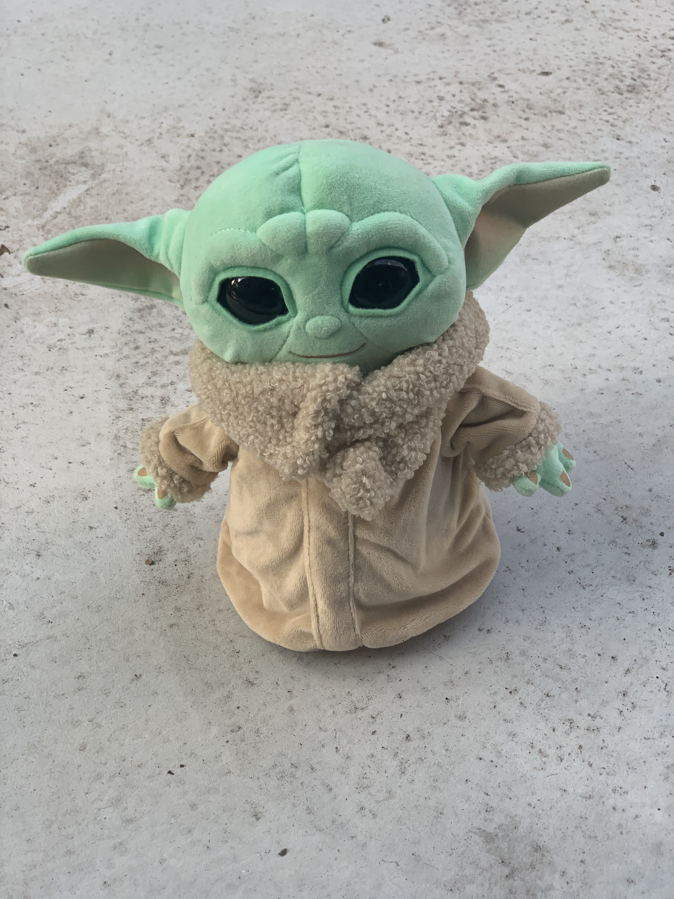
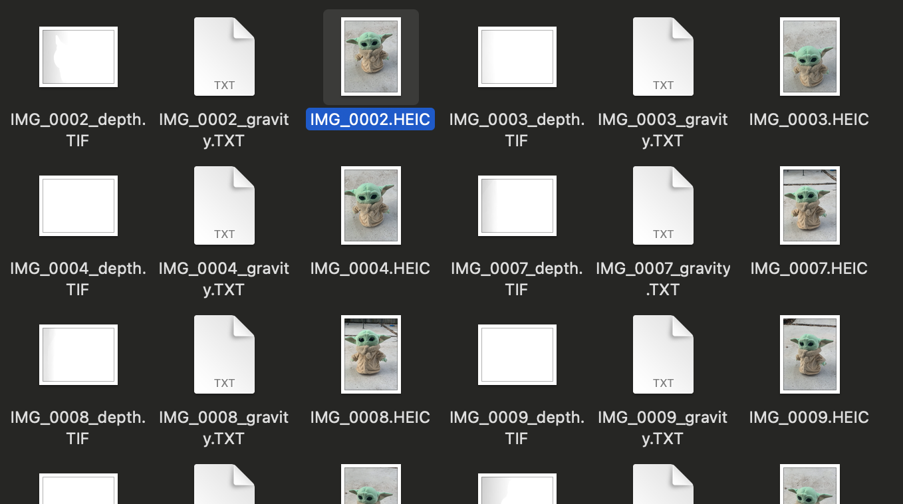
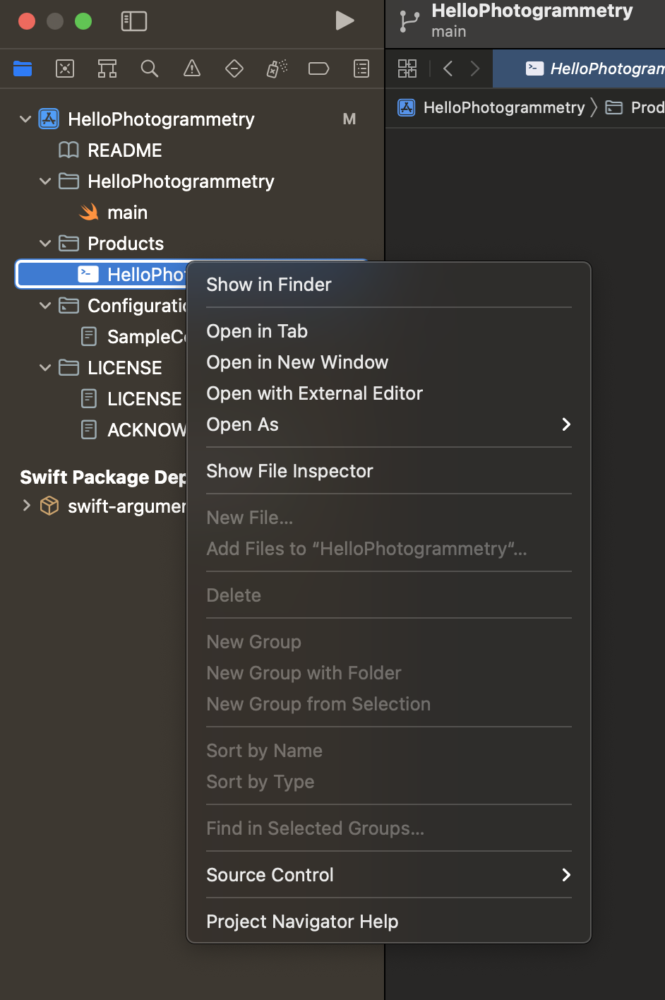

Alright, I saw the inclusion of photogrammetry in the developer documentation early on and I was hyped! 

Photogrammetry is where you take pictures of an object from all kinds of angles and then stitch them together to make a 3D model.

And usually, it’s not great.

I used one or two apps. And of course you take a bunch of photos and then upload them to a server and you get a model. And the results I got before weren’t great. For one, a chunk of the floor was included. Couldn’t quite figure out where to stop at the bottom.

I even tried a photogrammetry app that used the scanner for the face and generated a truly horrifying empty shell of my head.

So when I saw the stuff in the docs I was like, OMGosh, we’re going to be able to 3D scan right on the phone!

Well, not quite. Looking at it the PhotogrammetrySession object was Mac only. Huh.

So it turns out that you can take pictures with your phone and then you send them to your Mac and THEN you get your 3D model.

And not just any Mac. It has some beefy specs. Either M1 or it needs 4 GB AMD and 16 GB of RAM.

[Here is the video of the whole 3D capture presentation.](https://developer.apple.com/videos/play/wwdc2021/10076/?time=142)

So, my equipment met the specs. Why not give it a try?

I have an iPhone XS, which has the dual camera on the back that can read depth.

The sample code for the image capture app [is here](https://developer.apple.com/documentation/realitykit/taking_pictures_for_3d_object_capture). It’s set for iOS 15 but on the public release of Xcode reset to iOS 14 everything works fine on my non-beta phone.

You will, however, need macOS Monterey. 

And that’s so that you can run the [command line app here](https://developer.apple.com/documentation/realitykit/creating_a_photogrammetry_command-line_app).

So, I did a capture of my toddler’s plush Baby Yoda. 

      

This is Baby Yoda. Yes I know that’s not its name. But it’s Baby Yoda to me.

As you can see I took pictures of him on the concrete. I was outside. It was around sunset. The light was nice and diffuse. I took 85 pictures. Just went in a circle around the doll, getting a bottom, mid and toward the top shot. The sample app has a nice little guide about how to take the pictures.

The photos are stored in the Files app locally on the phone, so I just selected the folder and airdropped them to my Mac.

        

  As you can see, the images also have depth and gravity data since I used the iPhone XS. From what I understand, photos alone will work, but I haven’t checked the quality of that yet.

Finally, I compiled my command line tool on Xcode. When you do this, you want to open the Product in Finder like so.

        

  After that you open your Finder window in the terminal. You. can do that by Command, and right clicking (I use right click on my trackpad) on a folder in Finder.

Once I was where I wanted to be in Terminal I used the commands.

```
`./HelloPhotogrammetry ~/Desktop/yoda ~/Desktop/myYoda.usdz -d reduced`
```

  This means run the command line program, taking the photos and data from the “yoda” folder on the Desktop and make a USDZ file on the desktop. The detail is to make it “reduced” quality. Watch the video linked above or read the transcript for more information about different settings you can use.

[And that gave me this file I put on Dropbox, which should download to your iPhone if you let it.](https://www.dropbox.com/s/fz01h11lasq0i3z/myYoda.usdz?dl=0)

Or you can watch this video!

Checking out this 3D model of Baby Yoda.

  I mean it has shadows and everything. It’s pretty awesome.

Let me know what you think! I’m @wattmaller1 on Twitter. Would love to see your own awesome scans.