What I want to make is a simple PDF capture app. Lately with tax season, I'm uploading tons of docs, and I think I can offer something new.

PDF apps I've tried are often junky & ad-ridden, or they are too nice for me & with expensive subscriptions. I want to hit a sweet spot (or if I'm unlucky, a dead zone), with a single-purchase app that does just enough for a casual user. Like the Notes app’s PDF capture but more direct.

So, I've got a plan. We'll go with the flow of iOS and SwiftUI. Nothing terribly fancy, adjusting our designs to the direction of the APIs, and still get a lot out of it.

My first plan. Let's use DocumentGroup, new in iOS 14. So let's get started! First open Xcode and select "Create a new Xcode project"

  
      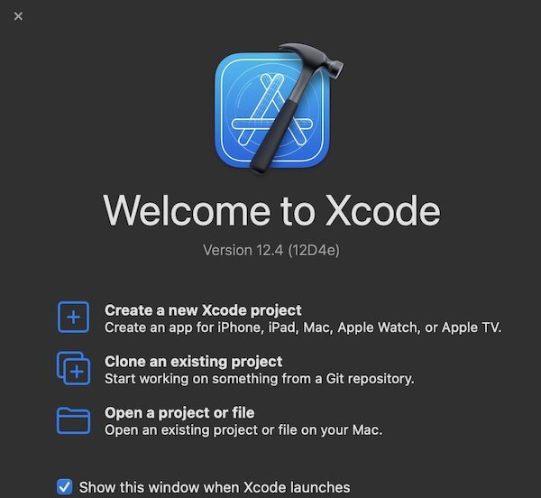
  

  Now select iOS (no sense making a Mac app at the moment, since the most useful part of the app is PDF capture with a camera). And the choose "Document App"

  
      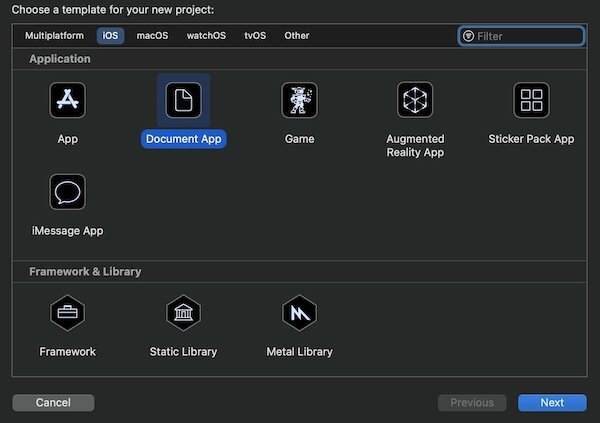
  

  Now let's give it a name, I'll call mine PDFTrapper, and make sure that you have selected Interface SwiftUI and lifecycle SwiftUI App.

  
      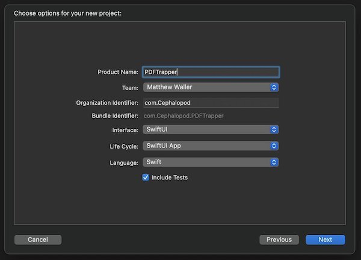
  

  Now let's see what we've got. I'll put all the code in one spot just for show and do some condensing, and we've got this.

  
      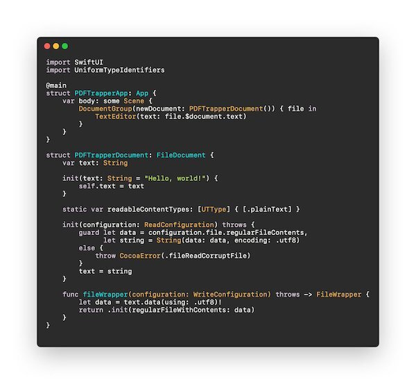
  

  What this gives us is really incredible for under 50 lines of code. The features are:

- Free file name changing

- Free cloud saving, local saving and any device integrated saving (Google Drive, Box, etc.) 

- Free sharing

- Free viewing as icons or list 

- Free deletion 

- Free duplication 

- Free ordering 

- Free metadata viewing

- Free tagging 

- Free folder management 

- Free searching 

- Free recents tab 

- Free accessibility

  
      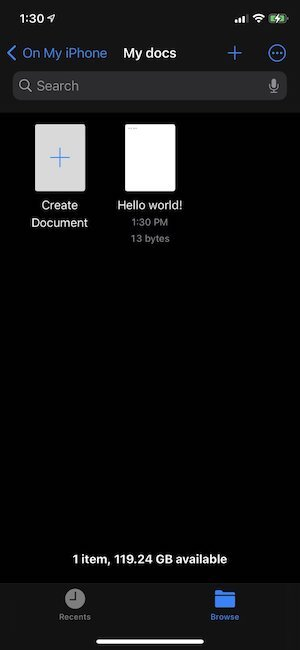
  

  
      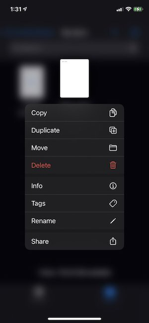
  

  All of this comes with tradeoffs though. There isn't much of a way at all to change the appearance. What you see is what you get. What we're making is a simple utility app though. So this approach is great for us.

At the moment though, this is a plan text editor. We just made a mini notes app with a lot of nice features! Now let's start making it our PDFTrapper app. Now my document looks like this, using PDFKit to replace the text with a PDF and handle the saving and reading

  
      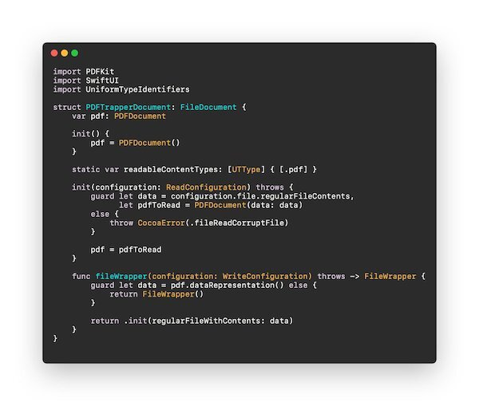
  

  So this is good, but we still need a way to display the PDF. To do that, I'll simply add a file to wrap PDFView and use it in my ContentView, like this:

  
      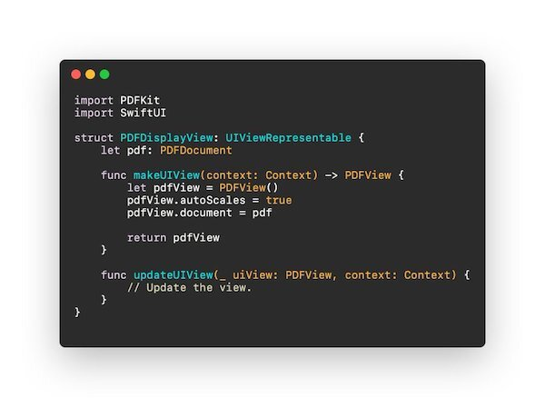
  

  
      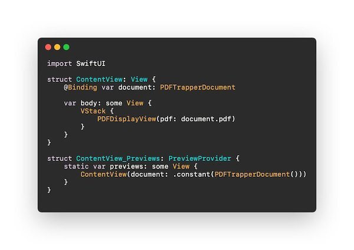
  

  Now we've created a blank PDF. Let's edited a little just as a sanity check, with a quick and dirty edit in the onAppear, and we get the annotation!

  
      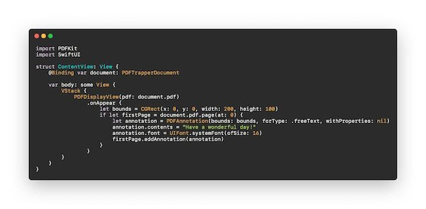
  

  
      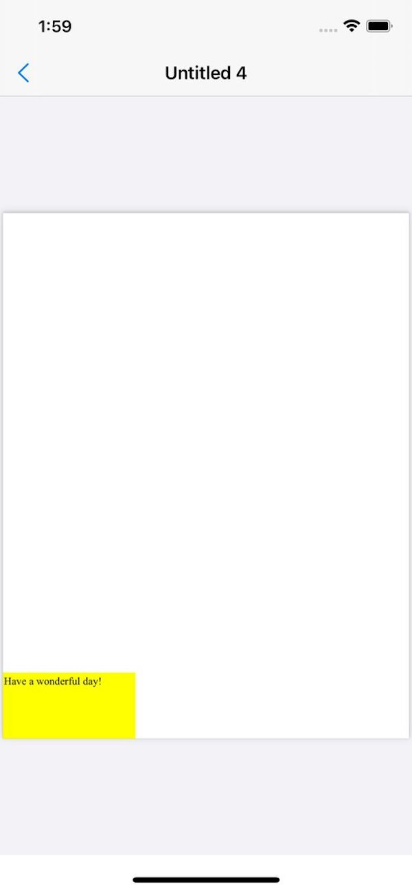
  

  There is something wrong though. Anyone want to guess what it is? Tune in for part two! [Sign up here](https://t.co/ybrkcoWDEe?amp=1) if you're interested in checking out the beta when it's ready :) And for any other comments, [say hi to me on Twitter](https://twitter.com/wattmaller1).