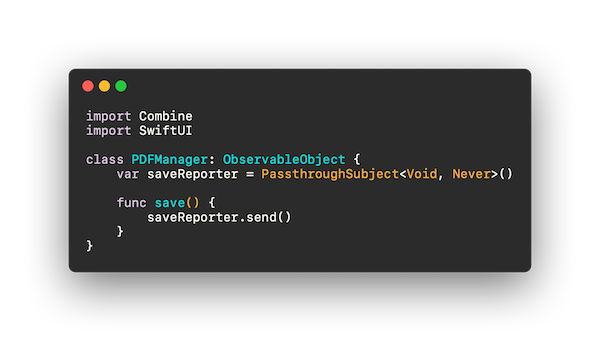
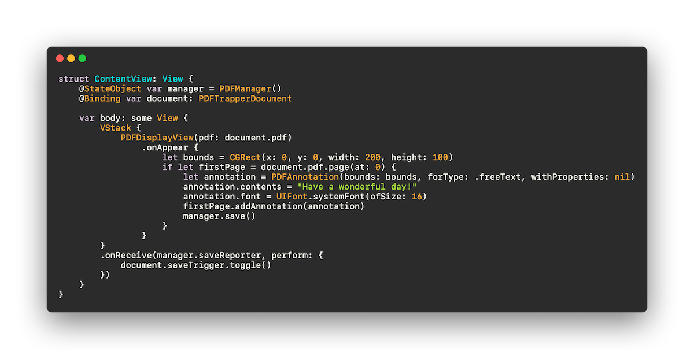
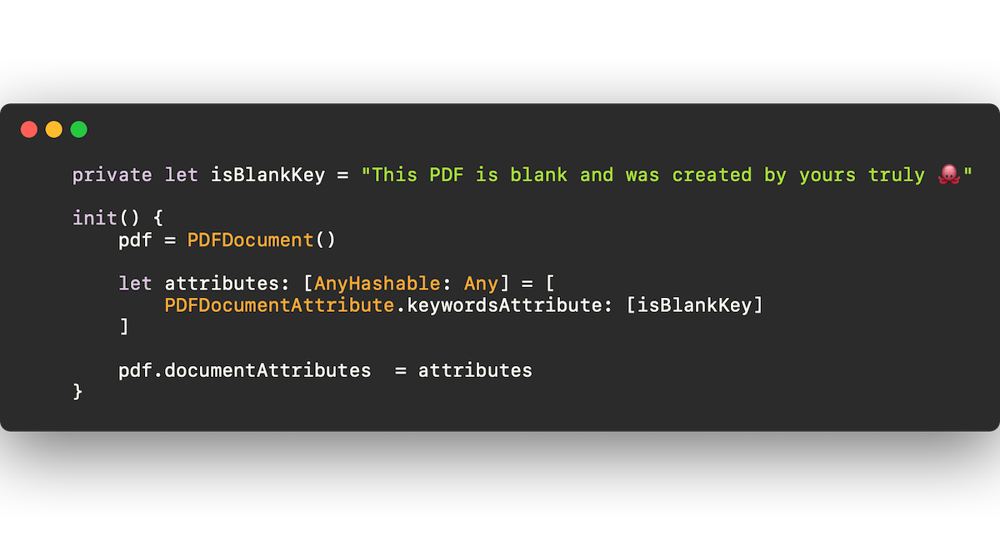
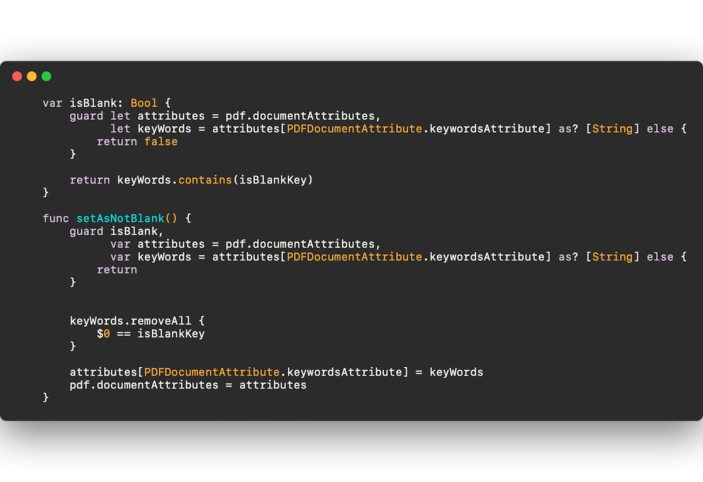
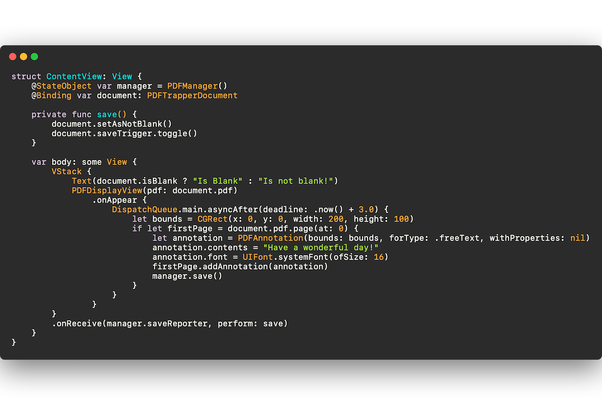
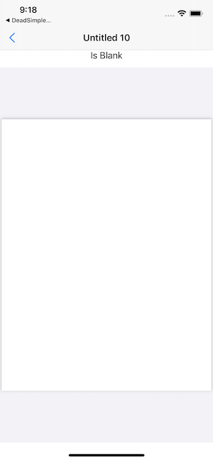
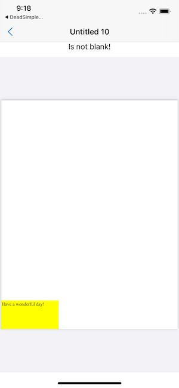

[Last time](https://www.cephalopod.studio/blog/making-a-pdf-capture-app-part-1), we left off with a cliff hanger. What was wrong with our PDF editing?

Answer: our changes didn’t persist. The fileWrapper function that saves the app never got called. Hmmm.

If you remember our text editing app, the string we passed in changed. And a String is a value type. In fact, the whole document is a value type! This means when we change something, the whole document changes, and that’s when the document get saved.

But the PDFDocument we’re using isn’t a struct or a value type. It’s a reference type. So when we change it, it doesn’t register for the whole document.

So how do we change it? I made a little hack. I give it something that can be changed, and when changed, triggers the save.

I added a simple Boolean to the document called “saveTrigger.”

And in my ContentView, I simply toggle the value on the document (the value doesn't matter; only changing the value matters).

But I don’t only want to save the view when I’m on the ContentView. So I have ContentView subscribe to the publisher of a StateObject I call PDFManager.

  
      
  

  And now my ContentView looks like this

  
      
  

  Persistence problem solved.

Now, before we get to the fun stuff, I have another setup issue I need to solve. I want to know if I’m looking at a newly created, blank PDF, or if the user has just selected a previously created PDF. Well, after searching around, there don’t seem to be any definitive answers on knowing whether a PDF has no content. So, when we create the PDF, let’s just leave some metadata that we’ve created a blank PDF!

Now, PDFKit won’t let you leave just any metadata with PDFDocument. You need to use a predefined PDFDocumentAttribute. The most useful one for our purposes is called keywordsAttribute. So we’ll set a keyword to value that is unlikely to be used elsewhere as a keyword, so that someone doesn’t accidentally use our keyword.

So now our init for PDFTrapperDocument looks like this:

  
      
  

  And we add a blankness property and a way to set it to not blank like this:

  
      
  

  Now we can test whether our PDF is marked as blank or not!

  
      
  

  Try it out and you’ll see that it starts as blank and after about 3 seconds the edit happens and the document says it is not blank. Success!

(BTW, at this point, don’t open an existing PDF that you don’t want edited, or it will get edited!) 

  
      
  

  
      
  

  Cool cool. Next week we can get to the fun stuff. Actually adding the document scanner! Stay tuned. [Sign up here](https://t.co/ybrkcoWDEe?amp=1) if you're interested in checking out the beta when it's ready :) And for any other comments, say hi to me on Twitter at [wattmaller1](https://twitter.com/wattmaller1).