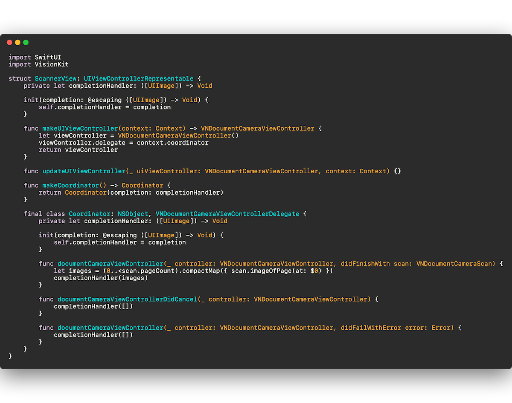
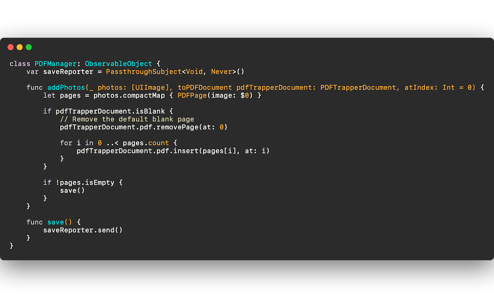
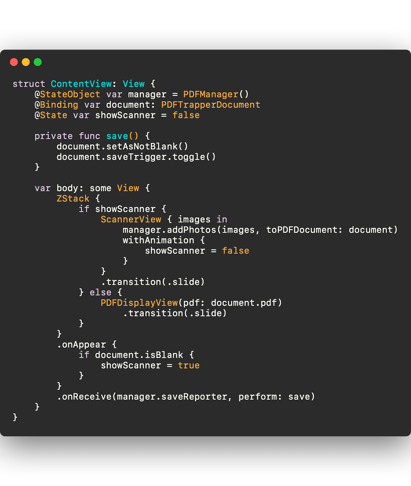

Alright, as promised, time to do some fun things. Let’s add the document scanner!

First things first. I’m going to create my ScannerView. This is just a VNDocumentCameraViewController wrapped in a UIViewControllerRepresentable, with a completion handler for when the images come back in the delegate, which will be our Coordinator.

  
      
  

  We’re going to think ahead about adding a button that lets you bring up the scanner to insert or append pages if you open an existing PDF. So I’ll add some logic to show the scanner if the document is blank, but otherwise, look to the scanner-button-pressed variable.

And of course, we add the code to take the image we get from the completion handler and feed them to our PDF manager, which will add the images to the PDF as individual pages!

So the PDFManager looks like this:

  
      
  

  And the ContentView looks like this (please notice the nice slide animation we are going to have going on; it is wonderful :)

  
      
  

  And, now that you’ll need to use the actual camera, don’t forget to add your privacy messages to the Info.plist, to tell the user why you need access to the camera.

And this is what we get!!!

  Welp. We’ve done it. We made a scanner app. And I have a confession to make. I already used it for my taxes! It went loads faster than previous years when I uploaded everything with the Notes app. 

It takes 2 taps to get to a saved scan in this app while it take 4 taps to do the same thing in the Notes app. Document after document, it adds up.

However, let’s not pat ourselves on the back too much just yet. For one, Notes does more than just save PDFs, even when working just with PDFs and it would be nice if our app did a bit more too, on the editing front.

And two, there is another built in challenger on the horizon. A little feature in a default app that I hadn’t known about. Do you know what that is? Find out next time as we go from an app that gets a job done, to an app that starts to become competitive!