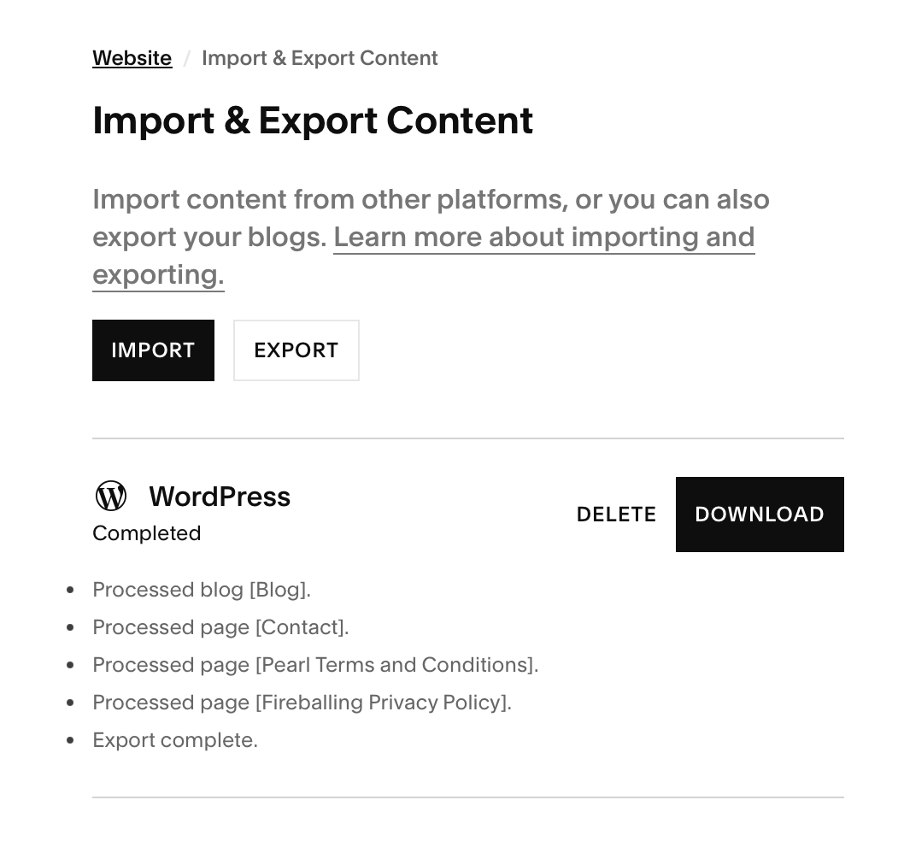
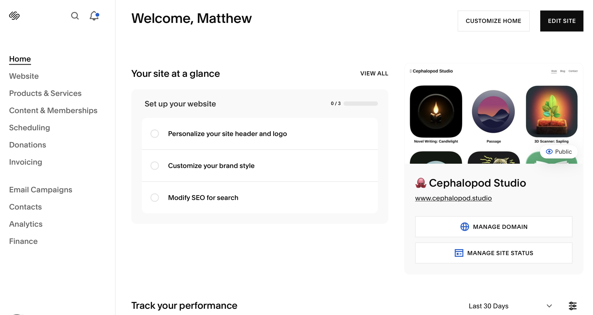
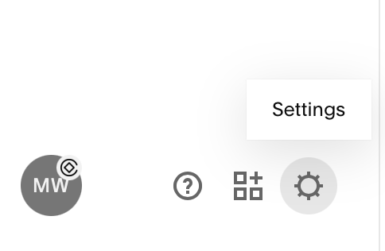
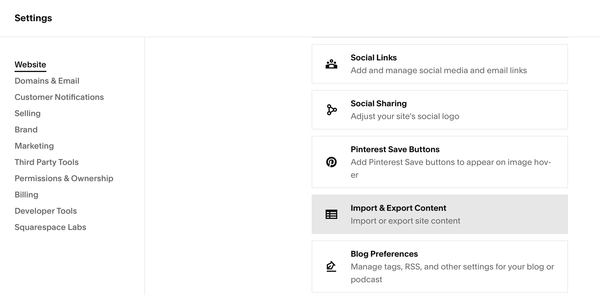
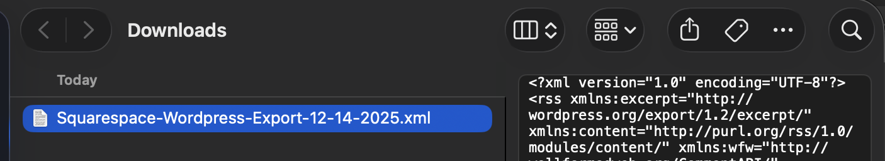
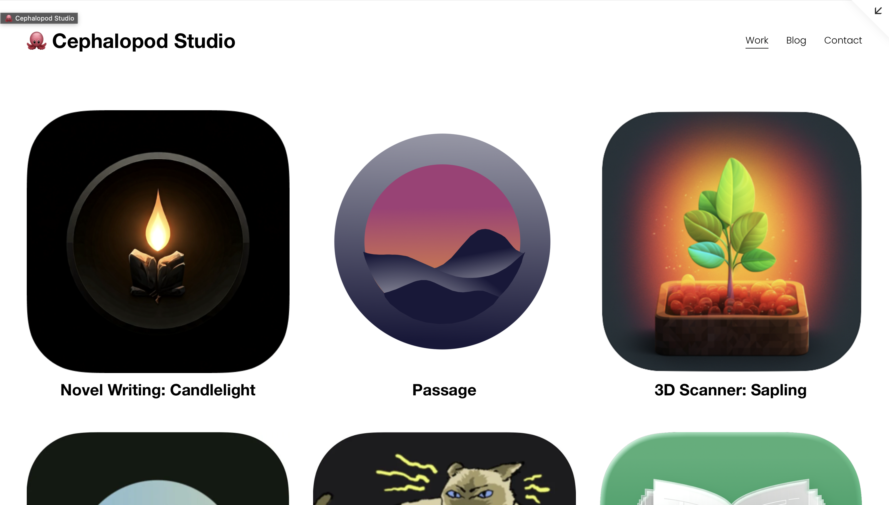
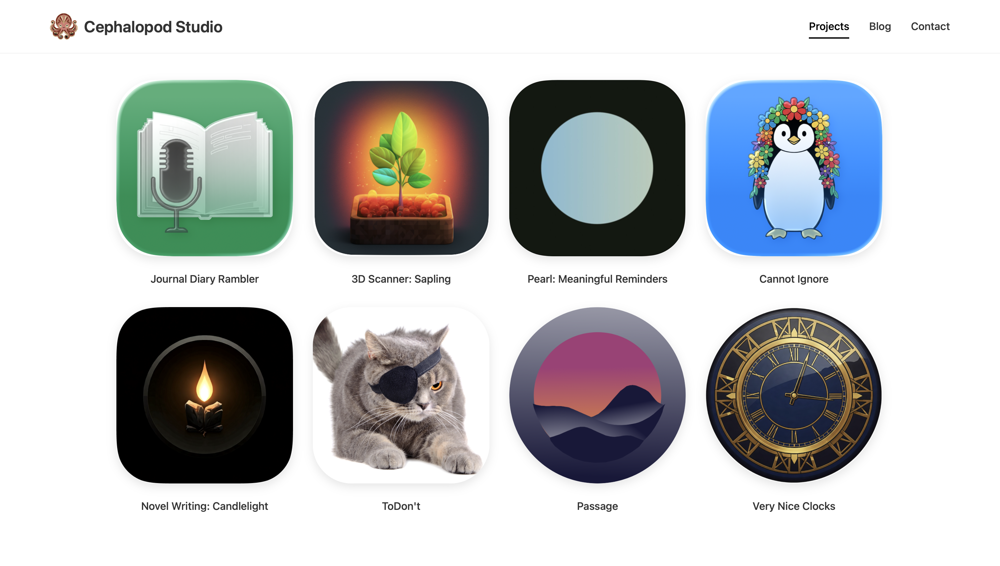

 

When I first started programming a decade ago, I had to focus. And I was focused on mobile. Thing is, if you want to make an app, the app stores from Google and Apple require an external website for things like privacy policies and such.

Learning the ins and outs of hosting a website and a blog for engagement, and all those other things was a lot on top of the basics of Objective-C, so I outsourced all that to Squarespace. It was nice. I played with some static website generation frameworks later, but it was clear that it was going to be a lot of work to make something pleasant to use. And the blog kept growing. Each entry was an impediment to migrating away.

This year, though, I had enough experience to do a proper migration, and a bevy of AI tools to help. So it was time. (And it was time to save $270 a year. So there was that.)

### Parsing the blog

I downloaded the blog from Squarespace.

From your website dashboard:
 

You can go to the settings button:
 

Then go to the import/export button.

And then download:

And you get your XML:

With all of that downloaded, I then wrote (with AI assistance) a script to create markdown files from all of the blog entries, and capture the images I had used. And then JavaScript to generate pages, the CSS, and more.

### Video Trap

There was only one real catch: videos.

Some of my videos were uploaded to Squarespace and I didn't find a good way to freely download those. 

For now those videos were omitted, and I kept the ones that were linked via YouTube. Down the line, I may recover those videos by screen capturing my computer while the videos are playing. It's kind of a mess though.

### Avoiding link rot

The other thing that I had to do with the blog was to make sure that the slugs match the same URL they had before, so that people with links to those blog posts still had access. So I made scripts for that as well.

### The rest of the owl

The remainder of the website was adjusting the portfolio side of things. I designed the front page from scratch. 

I also made each project page have the streaming video assets of my app preview videos on App Store Connect by diving into the inspect elements of the app pages on the web and finding the streaming urls for the videos.

Here is the site before:

And after:

### Was it worth it?

Most definitely. The cash savings are nice (though, these are side projects, so I'm sure proper hosting would be negligible for an operation generating substantial income), but it's also great to have a ton of freedom.

I had customized the Squarespace site here and there and it was a pain. Now I can adjust styles or update pages and use my AI of choice for the busy work.

The code for my whole site is available at https://github.com/MatthewWaller/CephalopodWebsite, including the scripts I used to generate the html from markdown, and the migrate_blog.py file I used to parse the XML, which is also on the site.

If you want to support and found this useful, rate an app! (Even if you don't end up making a purchase). This one is nice [my voice journaling app, Rambler](https://apps.apple.com/us/app/journal-diary-rambler/id6748891162).