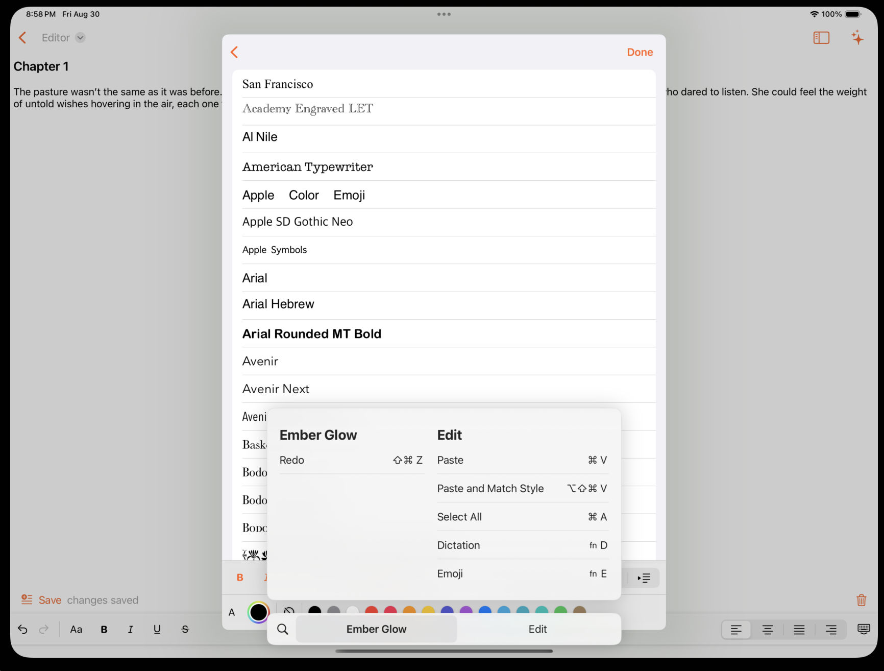
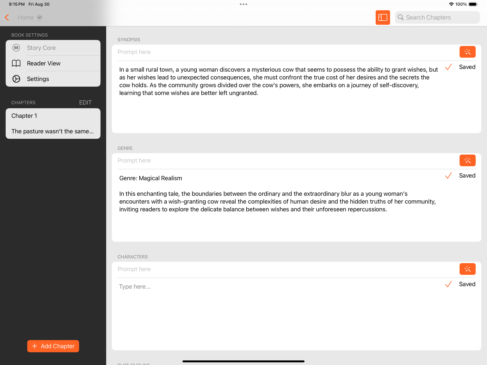

I’ve made my share of writing apps, and apps for writers. I’ve been a professional writer myself. In development, I’ve dealt plenty with UITextView, back before SwiftUI. When TextEditor came out in SwiftUI, I was excited for the possibility of simplifying a ton of text editing code. Alas, even today, if you have to do a lot of heavy lifting, I still recommend working via a wrapper around UITextView and NSTextView. 

TextEditor allows for scrollable, multiline text editing. And you can add styles to the text with simple SwiftUI modifiers. If you want rich text editing though, it doesn’t support NSAttributedString. It doesn’t even support the more recent AttributedString! That’s why, for the main text editor in my app [Ember Glow Writer](https://www.cephalopod.studio/work/ember-glow) we make good use of a solid UITextView and NSTextView wrapper called [RichTextKit](https://github.com/danielsaidi/RichTextKit) that interfaces nicely with SwiftUI. (We have a forked copy to adjust where necessary). 

        

### TextEditor: still useful

Where I ended up using TextEditor in Ember Glow is our Story Core. It’s a section where you can fill out a whole bunch of sections all about your book: characters, plot outline, writing style, genre, synopsis, world building and so on. I use all this information as context for what I call narrative autocomplete, so that you get three options of what to write next (or what to avoid) via generative AI (all optional, opt-in of course).

I didn’t need any fancy rich text for this job. I needed something simpler.

Originally, I tried to use TextField. This almost worked because now, if you supply an axis parameter to TextField, you can get the Textfield to grow to multiple lines. And you get a nice submit on enter, etc. However, in the Form element I was using, things started getting weird. When you had a large body of text, like you would with a plot outline, things jumped around as it put the middle of the TextField in focus, instead of the end or anywhere the cursor was. Which was confusing.

I also tried TextEditor out of the box after that, and it almost worked. Except that, in a Form, the TextEditor kept shrinking down to the size of a row. So I need some improvements.

### A few improvements

First thing I did was specify a minimum height size. This solves two problems. One: now I always have a good amount of space for large text. And two: the space is more inviting for the user. It gives the context clue that, hey, something should be here. It’s a space to fill out.

Second thing I did, was add placeholder. This is something you get for free in TextField, but not in TextEditor. So I did the simplest thing. I put an overlay on the TextEditor and placed some Text just in the right spot in the leading top corner of the TextEditor. Using simply body font size for accessibility changes. And secondary color to give it a faded look.

I also had to say hit testing false on the overlay so that people can tap on the editor. And I made the prompt configurable.

Without further ado, here is the full StoryCoreTextEditor code, including a Previews section so that you can easily play with it yourself.

```
`import SwiftUI

struct StoryCoreTextEditor: View {
    @Binding var text: String
    let prompt: String = "Type here..."
    var body: some View {
        TextEditor(text: $text)
            .frame(minHeight: 180)
            .overlay {
                if text.isEmpty {
                    VStack {
                        HStack {
                            Text(prompt)
                                .foregroundStyle(Color.secondary)
                                .padding(4)
                                .padding(.top, 4)
                            Spacer()
                        }
                        Spacer()
                    }
                    .allowsHitTesting(false)
                }
            }
    }
}

struct TextEditorPreviews: View {
    @State var text = ""
    var body: some View {
        StoryCoreTextEditor(text: $text)
    }
}

#Preview {
    Form {
        Section {
            TextEditorPreviews()
        } header: {
            Text("No text")
        }
        Section {
            TextEditorPreviews(text: "A little")
        } header: {
            Text("A little text")
        }
        Section {
            TextEditorPreviews(text: "A lot a lot a lot A lot a lot a lot A lot a lot a lot A lot a lot a lot A lot a lot a lot A lot a lot a lot A lot a lot a lot A lot a lot a lot A lot a lot a lot A lot a lot a lot A lot a lot a lot A lot a lot a lot A lot a lot a lot A lot a lot a lot A lot a lot a lot A lot a lot a lot A lot a lot a lot A lot a lot a lot A lot a lot a lot A lot a lot a lot A lot a lot a lot A lot a lot a lot A lot a lot a lot A lot a lot a lot A lot a lot a lot A lot a lot a lot A lot a lot a lot A lot a lot a lot A lot a lot a lot A lot a lot a lot A lot a lot a lot A lot a lot a lot A lot a lot a lot A lot a lot a lot A lot a lot a lot A lot a lot a lot A lot a lot a lot A lot a lot a lot A lot a lot a lot A lot a lot a lot A lot a lot a lot A lot a lot a lot")
        } header: {
            Text("A lot")
        }
    }
    .frame(maxWidth: 400)
}`
```

  And here is how it looks in the Story Core (the StoryCoreEditors are below the TextFields that hold the prompt to optionally generate each section.)

        

  Not bad! I do require the user to manually save their text. I don’t have the automatic press enter to save, but I could probably get there with custom key commands and/or an intercepting Binding<String>. So far, so good!