Let’s take a moment to slow down from bullet train speed of neural nets in Stable Diffusion, Midjourney, and Dalle-2 churning out art, and the neural nets from the ChatGPT Bing-ularity.

My day job is in fact Fusion Energy Machine Learning Tech Lead. (I have the best job, working with the folks at [sapientai.io](https://sapientai.io))

Let’s figure out how this machine learning stuff works at a very basic level. How do these systems learn? What, exactly, step-by-step, is going on inside of them? It can help parse out what is happening in the hype.

So for this post, we’ll take a look at some of the very basics, starting with the humble neural network.

We’ll come up with a neural network made from scratch that can predict home prices from a dataset we’ll custom create and we’ll do it with the Swift programming language, coding the whole thing in Swift Playgrounds.

[You can follow along in the code here](https://wattmaller1.gumroad.com/l/pxpxx) if you want to download the end-result. (Although that will also give away the surprise at the end of the blogpost).

I’ll explain the math and even explain a bunch of calculus basics for folks who have never learned, or have forgotten calculus. So kick back and relax as we take this riverboat tour of modern AI.

**The Neural Network**

These things have been around in some form since the 1940s. They sort of mimic the idea of neurons in the brain, where connections in a vast network get stronger and learn things. Specifically, a neuron has three main parts ([https://qbi.uq.edu.au/brain/brain-anatomy/what-neuron](https://qbi.uq.edu.au/brain/brain-anatomy/what-neuron)) dendrites that are like tree branches, an axon that are like tree roots, and a cell body (also called a soma) that is like the tree trunk. The dendrites receive input. The axon sends output. And there is something in the neuron that decides how much or how exactly to send that action.

       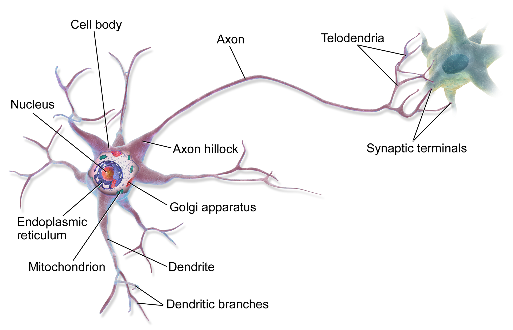 

  A neural network works off of this idea. We use mathematical formulas in a layer of neurons we’ll make that tell us what to do with input we receive, and how much and what kind of output to send forward to another layer of neurons. 

Each neuron has weights corresponding to their output. And those weights are adjusted when training the network, causing the network to “learn”. This idea of “deep learning” just means that our network is multiple layers, in particular that there is an inner “hidden” layer. This is really helpful, it turns out, to learn really complicated patterns. Other machine learning techniques like linear regression can’t do that, because linear regression, for instance, just divides data with straight lines when you graph them out.

Below you’ll see an image of a neural network. The arrows correspond to the weights. So the inputs would get multiplied by the weights, adjust a bit by a special activation function, and then passed on the next layer, all the way up the chain!

       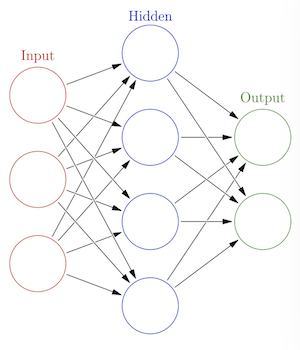 

  At a high level on the programming of neural nets, there are three main steps.

1. The forward propagation, where all of the neurons take an input and send signal all the way up all the layers to the end of the network.

1. The loss or cost function we use will say how wrong the final output was from the value we’re targeting. We get our error.

1. And the backward propagation uses calculus to send the error back through all the layers of neurons to tell them how wrong they were at their particular contribution, and to adjust themselves accordingly.

In training, this going forward and backward happens hundreds of thousands, millions (pretty sure billions too) of times until the neural net knows how to take some input, send it forward through all the layers, and give a correct output.

This is all very theoretical though, so let’s start coding up an example.

We’re going to make a neural net that predicts house prices from features of the house. You tell me how big your house is, the quality of the neighborhood, and so on, and our net will tell you how much your house should go for.

### Making the Housing Data

First off, let’s make some houses! We’re not going to use a real dataset, because we want to control for sure that there is a meaningful pattern for our net to discover.

First we’ll make the HomeInfo struct that holds the features of our houses and the value.

```
`struct HomeInfo {
    let neighborhoodQuality: Float
    let numberOfRooms: Float
    let squareFootage: Float
    var value: Float

    var trainingData: (features: [Float], targets: [Float]) {
        let features = [neighborhoodQuality, numberOfRooms, squareFootage]
        let target = [value]

        return (features: features, targets: target)
    }
}`
```

  The trainingData property is just a convenience for us later on. It will give us the features, and the value in a convenient format.

So, first things first, I’m going to make the secret formula that determines how much a house is worth in our fictional town. And I’ll make it part of a class called the HouseBuilder.

```
`class HouseBuilder {
    static func secretFormula(neighborhoodQuality: Float,
                          numberOfRooms: Float,
                          squareFootage: Float) -> Float {

        let neighborhoodQualityCoefficient: Float = 0.25
        let numberOfRoomsCoefficient: Float = 0.35
        let squareFootageCoefficient: Float = 0.4

        var value: Float = 0
        value += neighborhoodQualityCoefficient * neighborhoodQuality
        value += numberOfRoomsCoefficient * numberOfRooms
        value += squareFootageCoefficient * squareFootage

        return value
    }      
}`
```

  Here we see that the neighborhood quality makes up 25 percent of the value, square footage makes up 30 percent of the value, and so on.

All of our values will be between 0 and 1. This kind of normalization is common in deep learning, in part because the internals of neural networks eventually turn things to small values anyway.

This is the formula that we want our neural network to learn by only looking at the data. It won’t look the same because it will be expressed in weights and not in code, but it should give us the results we need.

Next, we’ll add a function to make some a random house, with values in our desired ranges.

```
`static func makeRandomHouse() -> HomeInfo {
        // No house too big! Just between 500 square feet and 10,000 square feet.
        let squareFootage = Float.random(in: 500 ..< 10000)

        // This is where we do the normalizing by scaling between 0 and 1.
        let normalizedSquareFootage = (squareFootage - 500.0) / (10000.0 - 500.0)

        // This is a made up number clearly, just as an example.
        let neighborhoodQuality = Float.random(in: 0 ..< 1)

        let numberOfRooms = Int.random(in: 1 ..< 10)

        let normalizedRooms = Float(numberOfRooms - 1) / Float(10 - 1)

        let homeValue = secretFormula(neighborhoodQuality: neighborhoodQuality, 
                                      numberOfRooms: normalizedRooms, 
                                      squareFootage: normalizedSquareFootage)

        let home = HomeInfo(neighborhoodQuality: neighborhoodQuality, 
                            numberOfRooms: normalizedRooms, 
                            squareFootage: normalizedSquareFootage,
                            value: homeValue)
        return home
    }`
```

  Just to make our home value look realistic and not just a value between 1 and 0, we’ll multiply by a million and then display the value with a number formatter. So, no houses worth more than a million in our town (that’s the sound of San Francisco laughing at me).

```
`static let priceFormatter: NumberFormatter = {
    let currencyFormatter = NumberFormatter()
    currencyFormatter.usesGroupingSeparator = true
    currencyFormatter.numberStyle = .currency
    currencyFormatter.locale = Locale.current
    currencyFormatter.maximumSignificantDigits = 4
    return currencyFormatter
}()

func formattedPriceValue(value: Float) -> String {
    let priceFloat = value * 1000000
    let nsNumber = NSNumber(value: priceFloat)
    let priceString = HouseBuilder.priceFormatter.string(from: nsNumber) ?? ""
    return priceString
}`
```

  Next we’ll initialize a list of homes, and we’ll add a @Published property for our homes to use in our SwiftUI views. And that will complete the HouseBuilder!

```
`class HouseBuilder: ObservableObject {
    @Published var homes: [HomeInfo] = []

    init() {
        initializeHomes()
    }

    func initializeHomes() {
        let numberOfHomes: Int = 500
        var results: [HomeInfo] = []
        for _ in 0 ..< numberOfHomes {
            let randomHome = HouseBuilder.makeRandomHouse()
            results.append(randomHome)
        }

        homes = results
    }

    ... [Other functions]
}`
```

  Awesome. That will give us the data. Next up: learning some basics about calculus to understand how our neural net will learn.

### Understanding the Math for Beginners

Alright, we’re going to learn some calculus, starting all the way back with how to plot a line using a function. If you already know calculus, you are free to skip ahead to the next section. In practice, even when you’re coding up your own neural network architectures and training models, you don’t often calculate derivates for functions, unless you’re pioneering in new methods of machine learning, for research and academic purposes. So even when you bust out PyTorch and Tensorflow and all those libraries for some proper training down the line, you won’t be taking what are called derivatives very much, for instance.

However, it’s still an excellent idea to understand in general what is happening internally for those advanced cases and the days you want to pioneer yourself!

So, again, let’s start at graphing functions.

A lot of lines are defined at y = Mx + b. So that could look like y = 4x + 5, or y = 2x +9.

Take a line that is defined as y = 2x. (You could also write it as y = 2x + 0).

To graph or plot it out, you take a value for x from the x axis, plug it in, and that give you your value for the y axis. So for x = 2 in this case I get 4, x = 5 I get 10, and so on.

When you graph the function y = 2x with as many points as you can, it looks like this:

       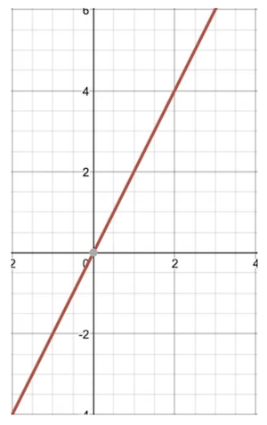 

Now calculus is all about slopes, rates of change, so let’s look at that next.

### **What is a slope?**

The slope essentially means the steepness of the line. The way we find it for this line is to take two points on the line and subtract the second y value from the first y value, and then take that and divide it by the second x value subtracted from the first x value.

So for this line, let’s look at two points. We have a point at (x = 1, y = 2), or (1, 2), and we have a point at (x = 2, y = 4), or (2, 4)

So our formula for slope is (y2nd - y1st / x2nd - x1st), which for us mean (4 -2 / 2–1), which is (2 / 1) which is 2. So our slope for the line between those two points is 2. And because this is a straight line, no matter what two points you choose on the line, the slope will always be 2.

And 2 is a positive number, so our slope is positive.

Let’s look at a negative slope really quickly.

       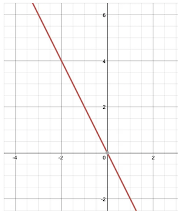 

So we can see that this line slopes downward from left to right. And there are two points on it. There is (-2, 4) and there is (2, -4), which means the slope

= ((-4 - 4) / 2 - (-2))

= (-8/ 4)

= -2

So our slope is -2

Basically if you see a straight line going down from left to right, it’s negative, and if you see a straight line going up from left to right, it’s positive, in a standard coordinate system.

So that’s what a slope looks like on a straight line.

What about on a curved line?

Here we see the graph of the line y = x².

       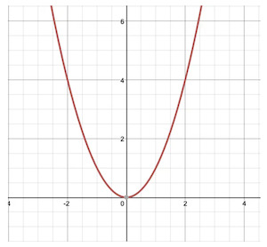 

  Let’s take two points on this line and find the slope.

Let’s look at (-1, 1) and (-2, 4).

       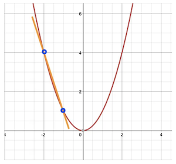 

  Using our formula, this slope equals -3

What about if those points got closer together though? Maybe we use (-1.25, 1.5625) and (-1.75, 3.0625). Then in our formula for slope, this becomes 1.5/0.5 = -3.

      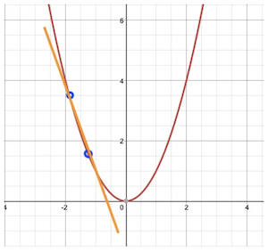

  Interesting. As we slowly move the points toward each other, their slopes, in this case, stay at -3.

But what happens when those two points actually meet in the middle? What happens when the two points become one point?

This is also known as what happens to the slope when the limit approaches 0. When the distance between the points is zero, how do we calculate the slope? In our formula we needed two points, but if they meet in the middle, we only have one.

One way to do this is to imagine that the two points never quite meet in the middle, but get infinitely close. We say that the limit approaches 0 instead of actually becomes 0. That way we can imagine that we have two points that are super close to one another.

The way it looks when graphed is that the line sort of just shoots across the line like a bullet grazing a mound, or a stick placed against a curved wall.

      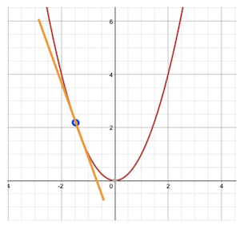

And that’s the slope at that point. Well, as the limit approaches 0.

So let’s look at a graph of several slopes on this line where the limit approaches 0.

      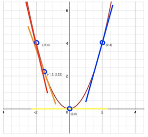

You can see that at some points, the slope is negative. At other points it’s positive. In fact, at 0, the slope is 0. It’s just a straight across flat line.

So here is an interesting question: What if we made a graph of all the slopes? We could treat the value of each slope like a new y coordinate with in a different graph. It’s like we could make a new line (and in so doing, a new function, or formula). We would be finding a new line with its own slopes! We could be finding the slope of our slopes!

And here is the heart of what we’re after, this line of slopes, is the derivative.

This process of taking all the possible slopes of a line, and using those slopes as values for a new line, is conceptually behind taking the derivative of a function.

So let’s look at a bunch of our slopes and make a graph of them.

So at -1.5 we saw that our slope line has a value of -3. So we put a dot at (-1.5, 3). And we see that at -2 or slope is -4. So we put a dot at (-2, -4). And at 0 we saw our slope was 0, so we put appoint at (0,0). And at 2, our slope is 4, so we put a dot at (2,4).

      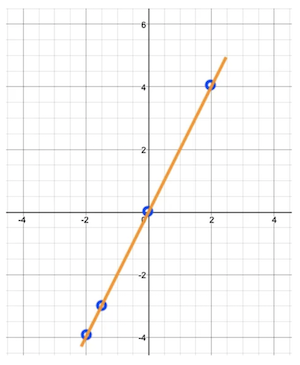

At this point you can eyeball that we’re making a straight line. And this straight line has its own formula. In our case, every time we have a value for x, the y value is twice as much. In fact, the value for this is y = 2x!

There are mathematical ways of demonstrating that the derivative of y = x² is equal to 2x. There are formal proofs that demonstrate what’s going on. And in the next post, we’ll teach you the shortcuts that mathematicians use to workout calculus problems on paper or in their head.

For now you’ve got the basic concept, basically we’re finding the formula for the slope anywhere along the original line.

So when we have a function (you’ll notice I’m using the words formula and function kind of interchangeably. I’ll start just calling it function) like y = x², the derivative of that function is y = 2x.

So that’s the concept behind finding a derivative!

The specifics of calculating derivatives are out of the scope of this article, especially the proofs for why those calculations work, but I once made a [cheat sheet](https://medium.com/@mattatblueshiftdevelopment/handwriting-a-neural-net-part-7-calculus-cheat-sheet-4cbb0edbdb24) if you want to calculate derivatives yourself. 

### How does finding the derivative help?

When plotting all of our errors from our network calculating our target value, we get a curvy plot. We want to find the lowest point on that curve, and where the slope will equal zero. So finding the derivative and whether it’s positive or negative tells us a little about where we are on the curve, and therefore, how much to update each weight.

For instance, if calculate the derivative and it’s very steep and it’s positive, we can update our our weights by a lot in the negative direction. But if our derivative is a low number and it’s negative, we know to update our weights by a little in the positive direction.

This is a process called gradient descent. We’re finding the gradient/slope with respect to the weights and updating them accordingly so that we travel down the slope.

### Making the Neuron and Layers

Let’s start with the humble neuron. In a lot of examples of neural nets, you’ll find matrix multiplications. Instead of looping over the neurons and their weights, it’s enough to do the old rows-times-columns of matrix multiplication to get the same effect. Here though, we’re going to break things down to keep it as simple as we can. And that means having individual neurons that we can see and reason about.

Part of our neuron is going to be its activation. After our neuron multiplies all of its inputs by its weights, it’s going to transform the output a bit with an activation function. We will use a function called sigmoid. This is what it looks like when you plot values in it.

       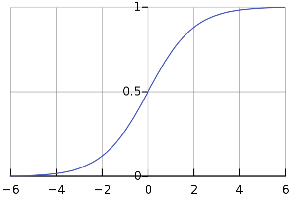 

  Sigmoid gets its name from that graph, meaning when you plot a lot of values with it, looks like an S-curve. Our particular sigmoid is this: 1 / (1 + e of -x). The e stands for something really cool: Euler’s number. It’s equal to about 2.71828. It’s pronounced “oiler.” It’s kind of like pi. It has some fascinating properties, especially for calculus, which we’ll be going over soon. Check out [this link about e](https://www.popularmechanics.com/science/math/a24383/mathematical-constant-e/) for fun!

So what is does is, no matter our input, it squeezes it between 0 and 1 as an output.

Let’s make that activation. And let’s make a function for the derivative too, since we’ll need that when we’re going backwards.

I’m also going to make a “blank” activation that doesn’t change the value, just multiplies it times one. And that means the derivative is just the number one. The blank activation will help us with the last layer, where we don’t want to force the value to be 0 or 1, but have it in the range of our actual output data.

```
`enum ActivationFunction {
    case sigmoid
    case blank

    func forward(x: Float) -> Float {
        switch self {
        case .sigmoid:
            return 1 / (1 + exp(-x))
        case .blank:
            return x * 1
        }
    }

    func derivative(x: Float) -> Float {
        switch self {
        case .sigmoid:
            return x * (1 - x)
        case .blank:
            return 1
        }
    }
}``
```

  Now that we have that, let’s make our neuron. You’ll notice that we make a number of weights. Those will correspond to the number of inputs we’re getting. So if we have three neurons behind us, then each neuron in the current layers will have three weights.

On activation, we take the number inputs we’re getting from the layer behind us, and then multiply by the weights, and then add that all together. And finally, we put that value through our activation function, in our case, sigmoid. We also store those values for updating the weights in the backward pass later.

```
`public class Neuron {
    var weights: [Float]
    var bias: Float
    var inputCache: [Float] = []
    var outputCache: Float = 0
    var delta: Float = 0
    var activation: ActivationFunction

    init(weightCount: Int, activation: ActivationFunction) {
        self.activation = activation
        bias = Float.random(in: 0 ..< 1)
        weights = []
        for _ in 0 ..< weightCount {
            weights.append(Float.random(in: 0 ..< 1))
        }
    }

    func activate(inputs: [Float]) -> Float {
        var value = bias
        for (index, weight) in weights.enumerated() {
            value += weight * inputs[index]
        }

        value = activation.forward(x: value)

        outputCache = value
        inputCache = inputs

        return value
    }
}`
```

  Now we’ve got one more function to add the neuron, and it’s where a lot of the magic happens. The activate function is for the forward pass. Now we have the backward pass. 

Here is where we will accept the error for this neuron, the learning rate, which tells us how big of a correction to make, and the errors that all of the neurons in this layers will update and then eventually pass backward to the previous layer.

```
`func backward(error: Float, learningRate: Float, errorsForPreviousLayer: [Float]) -> [Float] {
    var errorsToPassBackward = errorsForPreviousLayer
    let outputDerivativeError = error * self.activation.derivative(x: outputCache)

    // The index of the weight will correspond to the index of the neuron in the previous layer.
    for (weightIndex, weight) in weights.enumerated() {
        errorsToPassBackward[weightIndex] += outputDerivativeError * weight
    }

    // Now that we have that error, we can update the weights of our current neuron
    for (inputIndex, input) in inputCache.enumerated() {
        var currentWeight = weights[inputIndex]
        currentWeight -= learningRate * outputDerivativeError * input
        weights[inputIndex] = currentWeight
    }

    bias -= learningRate * outputDerivativeError

    return errorsToPassBackward
}`
```

  That’s a lot of neuron work! Next we’re going to make the layer.

You’ll notice that first, in the initializer, we create as many neurons as we have outputs, and like we discussed, the number of weights in each neuron is equal to the input size of the layer.

Next, we have the forward, which just takes the input from the previous layer and sends it to the neurons to do the activating.

Then, we have the backward. This takes an error and a learning rate, and we create an initial set of errors that will eventually go back to the previous layer. Then all of that gets passed  to the individual neurons for this layer to do their backward calculation.

```
`public class Layer {
    var neurons: [Neuron] = []
    var inputSize = 0
    var activation: ActivationFunction

    init(inputSize: Int, outputSize: Int, activation: ActivationFunction) {
        for _ in 0 ..< outputSize {
            let neuron = Neuron(weightCount: inputSize, activation: activation)
            neurons.append(neuron)
        }

        self.inputSize = inputSize
        self.activation = activation
    }

    func forward(inputs: [Float]) -> [Float] {
        var newInputs: [Float] = []
        for neuron in neurons {
            let activationValue = neuron.activate(inputs: inputs)
            newInputs.append(activationValue)
        }
        return newInputs
    }

    func backward(errors: [Float], learningRate: Float) -> [Float] {
        var errorsForPreviousLayer: [Float] = []

        // Here we prepare errors that we will pass to the layer behind us.
        for _ in 0 ..< self.inputSize {
            errorsForPreviousLayer.append(0)    
        }

        for (neuronIndex, neuron) in neurons.enumerated() {
            let error = errors[neuronIndex]

            // The neurons wil update their weigths with the errors, and also update the errors that will be passed to the previous layer.
            errorsForPreviousLayer = neuron.backward(error: error, learningRate: learningRate, errorsForPreviousLayer: errorsForPreviousLayer)
        }

        // Finally, we pass those errors to the layer behind us.
        return errorsForPreviousLayer
    }
}`
```

  Cool, now we can setup our neural net. You’ll see that I initialize two layers (well, technically three, but the first layer is just the raw input, so, we don’t count the first one).

And in the forward method, we just call forward for each layer!

And in the backward method, we just call backward for each layer!

We set it up so nicely that it’s easy to get the high level understanding.

And that predict method at the bottom? That’s just a forward pass really. We could do performance improvements, like not hanging onto an input and output cache, but here, it’s pretty straightforward.

```
`public class NeuralNetwork {
    private var layers: [Layer] = []
    public init(inputSize: Int, hiddenSize: Int, outputSize: Int) {
        self.layers.append(Layer(inputSize: inputSize, outputSize: hiddenSize, activation: .sigmoid))
        self.layers.append(Layer(inputSize: hiddenSize, outputSize: outputSize, activation: .sigmoid))
    }

    func forward(data: [Float]) -> [Float] {
        var inputs = data
        for layer in layers {
            let newInput = layer.forward(inputs: inputs)
            inputs = newInput
        }

        return inputs
    }

    func backward(errors: [Float], learningRate: Float) {
        var errors = errors
        for layer in layers.reversed() {
            errors = layer.backward(errors: errors, learningRate: learningRate)
        }
    }

    func predict(input: [Float]) -> [Float] {
        let output = forward(data: input)
        return output
    }

    // TODO: Setup train function. That comes next!
}`
```

### Preparing for training.

We’re going to train for a certain number of epochs. Each epoch, I’ll train on all 500 houses, and on the next epoch, start over again.

What I want to do next is to have a way to see how my network is performing. I’ll make a progress reporter that tells me what epoch I’m on, and what the total error is for that epoch. Here is my progress reporter:

```
`import SwiftUI

class ProgressReporter: ObservableObject {
    struct LearningError: Identifiable {
        var id: Int {
            epoch
        }
        let epoch: Int
        let error: Float
    }

    @MainActor
    func setData(newData: [LearningError]) async {
        data = newData
    }

    @MainActor
    func setFinished(_ finished: Bool) async {
        self.finished = finished
    }

    @Published var data: [LearningError] = []

    @Published var finished = false
}`
```

  We include the main actor bits because we’ll move training to a separate thread that won’t block the app, but then we’ll move back to it so that our chart can update.

The next core piece is our loss function. Also called the cost function. The loss allows us to tell the network how bad it did. Consider, what if you subtracted 2 from 1. Well you could say, update to account for being off by 1. But what if you subtracted -1 from -2. Well now we’ve got these pesky negatives.

One solution is to square the error (multiply it by itself), to handle the negatives, sum them up, and average them. This is the mean squared error (MSE). You could also do things like, just take the absolute values and so on, so I’ll make it an enum with more cases that could be added later.

We’ll want, not only the loss function, but the derivative of the loss function, for the backward part.

In the end, it looks like this:

```
`enum LossFunction {
    case mse

    func loss(forExpected expected: [Float], predicted: [Float]) -> Float {
        let squaredDifference = zip(expected, predicted).map{ expectedResult, predictedResult in 
            pow(expectedResult - predictedResult, 2.0) 
        }

        let average = squaredDifference.reduce(0, +) / Float(predicted.count)

        return average
    }

    func derivative(expected: [Float], predicted: [Float]) -> Float {
        let difference = zip(expected, predicted).map{ expectedResult, predictedResult in 
            2 * (expectedResult - predictedResult)
        }

        let sum = difference.reduce(0, +)
        return -(sum / Float(expected.count))
    }
}`
```

Now we can put that all together in our NeuralNet training function:

```
`func train(featureInput: [[Float]], targetOutput: [[Float]], epochs: Int, learningRate: Float, loss: LossFunction, reporter: ProgressReporter) {
    Task {

        await reporter.setFinished(false)

        var learningErrors: [ProgressReporter.LearningError] = []
        for epoch in 0 ..< epochs {
            var averageEpochError: Float = 0
            for (featureIndex, features) in featureInput.enumerated() {
                let outputs = forward(data: features)

                let expected = targetOutput[featureIndex]

                let error = loss.loss(forExpected: expected, predicted: outputs)

                // Total error is just for our reporting
                averageEpochError += (error / 2.0)

                let derivativeError = loss.derivative(expected: expected, predicted: outputs)

                backward(errors: [derivativeError], learningRate: learningRate)
            }

            let errorToReport = ProgressReporter.LearningError(epoch: epoch, error: averageEpochError)
            learningErrors.append(errorToReport)
            let errorsToReport = learningErrors
            Task {
                await reporter.setData(newData: errorsToReport)
            }
        }

        await reporter.setFinished(true)
    }   
}`
```

  Those feature inputs could be a list of 500 lists of features (hence it’s a nested list), and they are in the same order as the list of target outputs.

For instance, the very first feature inputs could be [0.1, 0.5, 0.3] and the very first target output might be [0.2]

This could mean that 0.1 represents the percentage of 10% between 500 and 10,000 square feet for a house. And 0.5 could represent a neighborhood quality score. And 0.3 could represent the percentage of 30% between 1 and 10 rooms. And the target 0.2 might mean that this how is the 20 percent between, say $500 and $1 million dollar home.

Thus for our very first inputs and outputs we tell the neural net, hey, understand that if you see a home with these inputs, give us a value with this output. There could be other target outputs. That’s why we have a list. But in this case, our list only has one number in it, the target price.

Then for each epoch, we do the three steps: pass the inputs forward, calculate the loss, and then pass the error backward.

And that’s it for the neural net!

Next, let’s put it into practice.

### Building the Brain

I’m going to make a Brain class to handle running the network and being the go-between for our house data and the neural network.

First I’ll define some house thoughts, so that we can keep track of what the brain thinks of house prices over time.

```
`struct HouseThought: Identifiable {
    let id = UUID()
    var homeInfo: HomeInfo
    let predictedValue: Float
}`
```

  Next I’ll make the Brain class itself. 

It has four parts.

1) First there is the initialization/creation of the brain. We call initializeNetwork to create our network with 5 inputs, a hidden size of 7, and an output size of 1. The 5 inputs will be those five characteristics of a house we created in the beginning. The hidden size is the size of our middle layer between input and output. And the output size is just 1 because we have just one property we’re trying to predict: the price. We’ll make three random houses and call a function evaluateNetwork that is basically getting predictions before we’ve trained the network. This way we can see if, after training, our price predictions are better than the unlearned ones. Then we put those in unlearnedThoughts, for display later.

2) InitializeNetwork is the init function all over again

3) evaluateNetwork takes the list of homes and gets predictions.

4) And finally, learn takes a group of homes and does the learning. First it breaks apart the features from the target values to predict, sets the number of epochs, learning rate, loss function, and gives the network a reporter. And finally, it tells it to train!

```
`class Brain: ObservableObject {

    // Just creating an empty network as a placeholder
    var network: NeuralNetwork = NeuralNetwork(inputSize: 0, hiddenSize: 0, outputSize: 0)

    @Published var learnedThoughts: [HouseThought] = []
    @Published var unlearnedThoughts: [HouseThought] = []

    init() {
        initializeNetwork()    
    }

    func initializeNetwork() {
        network = NeuralNetwork(inputSize: 5, 
                                hiddenSize: 7, 
                                outputSize: 1)
        let homes = [HouseBuilder.makeRandomHouse(),
                     HouseBuilder.makeRandomHouse(),
                     HouseBuilder.makeRandomHouse()]
        unlearnedThoughts = evaluateNetwork(withHomes: homes)  
    }

    func evaluateNetwork(withHomes homes: [HomeInfo]) -> [HouseThought] {
        var evaluations: [HouseThought] = []
        for home in homes {
            let resultList = network.predict(input: home.trainingData.features)

            let predictedValue = resultList[0]

            let thought = HouseThought(homeInfo: home, predictedValue: predictedValue)

            evaluations.append(thought)
        }

        return evaluations        
    }

    func learn(fromHomes homes: [HomeInfo], reporter: ProgressReporter) {
        let featureData: [[Float]] = homes.map { home in
            let trainingValues = home.trainingData.features
            return trainingValues
        }

        let targetData: [[Float]] = homes.map { home in
            let target = home.trainingData.targets
            return target
        }

        let epochs = 100
        let learningRate: Float = 0.1

        network.train(featureInput: featureData, 
                      targetOutput: targetData, 
                      epochs: epochs, 
                      learningRate: learningRate,
                      loss: .mse,
                      reporter: reporter)
    }
}`
```

### Displaying the Neural Network

Now let’s make some UI so we can see how are training goes.

Here is our training view. Just a button to train, and a button to restart. And a Swift Chart to show our epochs and our error over time. with any luck, the error goes way, way down.

```
`import SwiftUI
import Charts

struct TrainingView: View {
    @ObservedObject var brain: Brain
    @StateObject var reporter = ProgressReporter()
    let builder: HouseBuilder
    var body: some View {
        VStack {
            Text("Finshed Training: \(String(reporter.finished))")
                .font(.title)
                .padding()
            Chart(reporter.data) { trainingError in
                LineMark(
                    x: .value("Epoch", trainingError.epoch),
                    y: .value("Total Error", trainingError.error)
                )
            }
            .chartXAxisLabel("Epochs")
            .chartYAxisLabel("Learning Error")
            .padding()
            HStack {
                Button("Train") {
                    brain.learn(fromHomes: builder.homes, reporter: reporter)
                }
                Button("Rebuild Network/Start over") {
                    brain.initializeNetwork()
                }
            }
            .buttonStyle(.borderedProminent)
            .controlSize(.large)
        }
    }
}`
```

  And we’ll want to see how it performs when it finishes training too. So let’s make the evaluation view. It’s essentially a list with one big button to predict the value of three randomly created houses, a section to display the price predictions of the untrained network, and a section to display the price predictions of a trained network.

```
`import SwiftUI

struct EvaluationView: View {
    @ObservedObject var brain: Brain
    let builder: HouseBuilder

    var body: some View {
        VStack {
            Button("Evaluate Network / Get Learned Thoughts / Network Predictions") {
                let homes = [HouseBuilder.makeRandomHouse(),
                             HouseBuilder.makeRandomHouse(),
                             HouseBuilder.makeRandomHouse()]
                brain.learnedThoughts = brain.evaluateNetwork(withHomes: homes)
            }
            List {
                Section(header: Text("Unlearned Thoughts")) { 
                    ForEach(brain.unlearnedThoughts) { thought in
                        HouseThoughtCell(builder: builder, thought: thought)
                    }
                }
                Section(header: Text("Learned Thoughts")) {
                    ForEach(brain.learnedThoughts) { thought in
                        HouseThoughtCell(builder: builder, thought: thought)
                    }
                }
            }
        }
        .buttonStyle(.borderedProminent)
        .controlSize(.large)
    }
}

struct HouseThoughtCell: View {
    let builder: HouseBuilder
    let thought: HouseThought
    var body: some View {
        VStack(alignment: .leading, spacing: 18) {
            Text("Actual \(builder.formattedPriceValue(value: thought.homeInfo.value))")
                .padding(.bottom, -12)
            Text("Predicted \(builder.formattedPriceValue(value: thought.predictedValue))")
            Text("Difference \(builder.formattedPriceValue(value: abs(thought.predictedValue - thought.homeInfo.value))) ")
                .fontWeight(.bold)
        }

    }
}`
```

  And now we put that in our top-level ContentView.swift

```
`import SwiftUI

struct ContentView: View {
    @StateObject var builder = HouseBuilder()
    @StateObject var brain = Brain()

    var body: some View {
        TabView {
            TrainingView(brain: brain, builder: builder)
                .tabItem { 
                    Label("Train", systemImage: "train.side.front.car") 
                }
            EvaluationView(brain: brain, builder: builder)
                .tabItem { 
                    Label("Evaluation", systemImage: "wand.and.stars") 
                }
        }
    }
}`
```

And our ContentView goes in our app, Sydney (iykyk)

```
`import SwiftUI

@main
struct Sydney: App {
    var body: some Scene {
        WindowGroup {
            ContentView()
        }
    }
}`
```

  And this is what we get!

  As you can see, we get terrible price predictions from the network before it has been trained.

And the predictions are more than 10x better after being trained, even when predicting housing data it has never seen before! However, it’s not perfect, and likely won’t be with this setup. Generally you want to save part of the data for a validation step to make sure that the network isn’t overfitting. Overfitting is where the network learns its training data so well that it doesn’t generalize to other examples later. There is also a lot of room to experiment with the best setup: more layers, different activations, different losses, etc. For now though, it’s pretty awesome to see orders of magnitude improvement in learning.

### Where to from here?

There are so, so many ways to take advantage of machine learning as a developer. You can make architectures for the models (new activations, better loss functions, different layer shapes). You can work on getting good datasets. You can focus on deploying models. And, of course, you can make the thousands of different kinds of apps that these machine learning models enable.

Most of the work of developing new ML models happens in Python right now. It’s the workhorse. Thankfully, Python is a friendly language, and once you’ve got the basics, the concepts here can help navigate what is going on in Python frameworks like PyTorch and Tensorflow.

However, there are so many possibilities just in the iOS and Mac world too, with native Apple platforms.

- You can take models converted from Python to the [native CoreML libraries and integrate them with new and existing apps as showcased here.](https://developer.apple.com/machine-learning/models/)

- You can skip the ML things and just use the end-resulting superpowers by using things like the Vision and Natural Language frameworks as seen [here](https://developer.apple.com/machine-learning/api/).

- And you can create your own models all on the Apple platforms [here with CreateML](https://developer.apple.com/machine-learning/create-ml/).

Mind you, all three of those broad lists of options are all on the device and don’t even need an Internet connection to operate.

And then, of course, there are things like OpenAI’s ChatGPT natural language superpowers and the DALLE image generators.

### The Surprise!

As an example of using existing machine learning capabilities, I’m packaging in a bare-bones starter app that let’s you make your very own ChatGPT, or at least begin that process, You’ll supply your API key, and then you’re off to the races. I’ll plan on a separate blog post explaining what each part of the code does.

  [You can download the whole package as both a Swift Playground and Xcode project at this link](https://wattmaller1.gumroad.com/l/pxpxx), as a pay-what-you-can feature if you want to support me. Thanks so much, and happy programming.