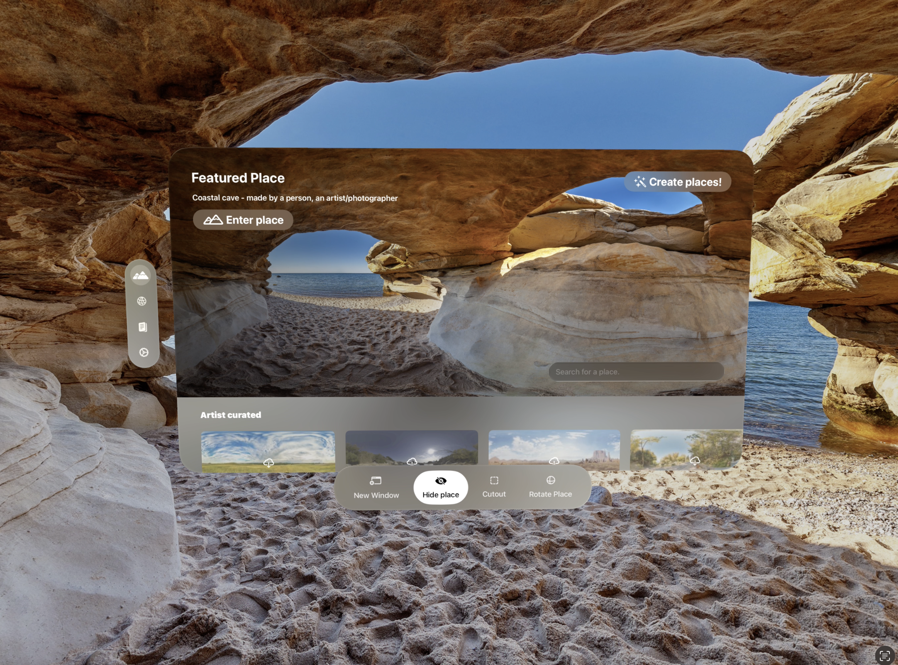

 

  Let’s say this up front: making apps on the Apple Vision Pro is not a gold rush. I am not retired, nor are the folks I’ve partnered with on this fun journey of making cool apps on a really cool platform.

Even so, I’ve been an iOS developer for more than a decade, and [Passage](https://apps.apple.com/us/app/flowriter-writers-retreat/id6470159510) is the second-highest paying app I ever made. (I sold one for real-time speech-to-text transcription way back before Whisper or anything like that). Passage, however, exceeded expectations, and has been a blast to make, and that app alone has paid off one Vision Pro headset and then some.

### What the app does

The app lets you create or browse immersive environments where you can do writing with an in-app word processor and writing file system, or you can use the in-app browser to do work, or watch a movie. It’s currently my favorite way to watch YouTube and Netflix, since my credentials are saved there, and when I’m stoked to watch a show, I can go all out with a custom environment for watching shows. (I made a fantastical alien world to watch all of Scavengers Reign; that show was so good).

We put in our document editor and our browser because you can’t have windows from other 3rd party apps in at the same time as your own immersive environment. (There is a way, however, to get [your whole Mac desktop visible in immersive environments](/blog/seeing-your-mac-in-3rd-party-immersive-apps-on-the-vision-pro), so that’s pretty great).

The way you make your own custom world is with AI. We worked closely with [Blockade Labs](https://www.blockadelabs.com) to the point of being a guinea pig where they brought the resolution from 4k to 8k, which was a really nice step up. And you can upload your own images up to 16k in resolution, if you’ve got them, whether AI or your own artwork.

We also have a section where we bought licenses to real, high-quality 360 photos and artist-made work, and added that as its own section.

### Changing times

We were originally called “Flowriter” because of the emphasis on the writing, but we eventually were having so much fun finding different ways to get to new worlds that we rebranded pretty quickly as Passage.

One highlight was seeing the Flowriter icon at [WWDC 2024 in the keynote presentation](https://x.com/easyAbe_/status/1801066196315361710). Pretty wild. (I mean, they probably fit all of the day-one apps on that slide, but still, so cool).

Because we have to pay for our API costs, Passage was a subscription, but eventually we added ads (more on that in another blogpost). And our subscriber count jumped up at the beginning, and of course tapered off. And now it has begun to grow again, so that’s nice.

While we still have a handful of other costs related to the project,, we managed to clear the cost of a headset when a year rolled around. Now, two of us began this venture, and just for fun we added another friend who has been jamming with us on the app, so, we’re not entirely break even in that sense, but it’s a meaningful milestone. And of course, we’re on a nice track to eventually get there.

Whether Apple launches another Vision Pro or whether it goes with a cheaper headset or glasses, we’re still invested in visionOS in general, so it’s fun along the way. And we have other apps we would like to make too! More AR centric ones than requiring full immersion.

### Onward

It has been a spectacular ride thus far, and now, with a year gone, we have some incredible insights to share in how ads have performed, and how we’re adding full, 3D environments as part of our upcoming anniversary launch (not only 360 images). 

And we have a ways to go! We don’t have near the caliber of 3D software knowledge that [Gregory Weiber at Vibescape](https://x.com/dreamwieber/status/1875223827875303504) has, nor Apple’s budget, but we’re learning bits and pieces as we go (friends, Blender is complex; and BTW, if you’re a creator, and you have a USDZ deliverable that you believe would make a great environment, we have a modest budget to pay a professional!). 

Still, I’ve had one user tell me it’s their favorite app, and others who have have subscribed for the full year telling me how much they enjoy it, and it’s so much fun. Looking back after a year, I’m excited for more to come.