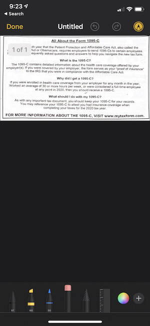

Alright, we’ve got a nice, useful little app for PDFs so far. Now let’s add some nice features that can put it at parity with what the Notes app can do with PDFs, now that we’ve made capturing the PDF smoother and more efficient.

You may have seen a screen like this:

  
      
  

  ****

Look at all the goodies in that editing toolbar! All kinds of markups, rulers, color pickers. Erasers!  Back and forth undo! And if you use the plus button, you can add text and **gasp** signatures! Saved signatures! It’s all there.

Dang. This would take us forever to make on our own. Is there a way to get this for ourselves?

There is! It’s called the QLPreviewController. The QL stands for Quick Look. And Quick Look has an editing mode with all of these features in it.

It would be nice to just take the controls of QLPreviewController and use them on our own, without needing an entirely separate view to appear. But that is the tradeoff.

So once again, we need to dip into UIKit and bring this into our SwiftUI. But we’ll do something different this time.

#### Wrapping QLPreviewController, First Try

You can see one handy method of adding the preview controller [here](https://lostmoa.com/blog/PreviewFilesWithQuickLookInSwiftUI/ ):

However, we need to add a delegate method to return QLPreviewItemEditingMode.updateContents to it so that it knows that it’s allowed to edit content.

****We’ll also need a URL. So we need to pass one in from our DocumentGroup.

We simply add a variable called var fileURL: URL? toward the top of our ContentView and then our DocumentGroup does this:

```
`struct PDFTrapperApp: App {
    var body: some Scene {
        DocumentGroup(newDocument: PDFTrapperDocument()) { file in
            ContentView(document: file.$document, fileURL: file.fileURL)
        }
    }
}`
```

  
I won’t give the code for this version of the PreviewController since there is a better way, but so far we get this!

  Not bad! The controls appear, we can edit our PDF. We can swipe down to dismiss. But, there are a number of problems.

First, we needed a NavigationController to hold the top editing controls, and we don’t get a back or a done button because we’re the first view controller in the stack! So we would need to manually add our editing button.

Another problem. We want a distraction free area for editing, and this modal has the background visible and a chance of accidentally swiping down to dismiss. 

And one other problem, you’ll notice in the video that the top left button transforms from a share icon to the pen icon. That’s not great. Looks a little buggy.

What’s the solution? A new way to present view controllers in SwiftUI.

#### Wrapping QLPreviewController, A Better Way

One trick with wrapping what I call specialty view controllers (UIDocumentPickerViewController, UIImagePickerController, UIReferenceLibraryViewController, etc.), is that they often expect more of a UIKit environment.

For instance,, to get the “Done” button you present QLPreviewController modally like this: present(previewController, animated: true, completion: nil) from a plain view controller.

So how can we do that in SwiftUI?

What I’ve found helpful is to wrap a plain UIViewController whose only job is to present these specialty controllers.

Kind of like this. First we have our PreviewControllerHolder:

```
`import Combine
import QuickLook

class PreviewControllerHolder: UIViewController {
    var cancellables = Set<AnyCancellable>()
    var url: URL
    var startEditing: PassthroughSubject<Void, Never>
    var endEditing: () -> Void

    var previewController = QLPreviewController()

    init(url: URL, startEditing: PassthroughSubject<Void, Never>, endEditing: @escaping () -> Void) {
        self.url = url
        self.startEditing = startEditing
        self.endEditing = endEditing
        super.init(nibName: nil, bundle: nil)
    }

    required init?(coder: NSCoder) {
        url = URL(fileURLWithPath: "")
        startEditing = PassthroughSubject<Void, Never>()
        endEditing = { }
        super.init(coder: coder)
    }

    override func viewDidLoad() {
        super.viewDidLoad()
        view.alpha = 0

        previewController.delegate = self
        previewController.dataSource = self

        startEditing
            .sink { [weak self] in
                guard let self = self else { return }
                self.present(self.previewController, animated: true, completion: nil)
        }
        .store(in: &cancellables)
    }
}

extension PreviewControllerHolder: QLPreviewControllerDataSource {
    func numberOfPreviewItems(in controller: QLPreviewController) -> Int {
        1
    }

    func previewController(_ controller: QLPreviewController, previewItemAt index: Int) -> QLPreviewItem {
        url as QLPreviewItem
    }
}

extension PreviewControllerHolder: QLPreviewControllerDelegate {
    func previewController(_ controller: QLPreviewController, editingModeFor previewItem: QLPreviewItem) -> QLPreviewItemEditingMode {
        .updateContents
    }

    func previewControllerDidDismiss(_ controller: QLPreviewController) {
        endEditing()
    }
}`
```

  And then we have our simple representable, QuickLookController:

```
`struct QuickLookController: UIViewControllerRepresentable {
    var startEditing: PassthroughSubject<Void, Never>
    var url: URL
    var endEditing: () -> Void

    func makeUIViewController(context: Context) -> PreviewControllerHolder {
        PreviewControllerHolder(url: url, startEditing: startEditing, endEditing: endEditing)
    }

    func updateUIViewController(_ viewController: PreviewControllerHolder, context: Context) {
        //
    }
}`
```

  I added publisher to say when to fire because we’re going to basically hide the holder somewhere on the ContentView (wherever we want really), and let it present the QuickLookController when ready. So it just lives in waiting within our SwiftUI views.

So I’m going to add this:

var startEditMode = PassthroughSubject<Void, Never>()

to the PDFManager.

We also have closure to know refresh the PDF in our ContentView when done editing. And we add a progress indicator and opacity animation for smooth transitions.

Now our ContentView looks like this!

```
`import Combine
import PDFKit
import SwiftUI

struct ContentView: View {
    @StateObject var manager = PDFManager()
    @Binding var document: PDFTrapperDocument
    @State var showScanner = false
    @State var isEditing = false
    var fileURL: URL?

    private func save() {
        document.setAsNotBlank()
        document.saveTrigger.toggle()
    }

    var body: some View {
        ZStack {
            if let url = fileURL {
                QuickLookController(startEditing: manager.startEditMode, url: url) {
                    if let refreshedPDF = PDFDocument(url: url) {
                        document.pdf = refreshedPDF
                        manager.saveReporter.send()
                        isEditing = false
                    }
                }
            }
            if showScanner {
                ScannerView { images in
                    manager.addPhotos(images, toPDFDocument: document)
                    withAnimation {
                        showScanner = false
                    }
                }
            } else {
                if !isEditing {
                    VStack {
                        PDFDisplayView(pdf: document.pdf)
                        Button("Editing Canvas") {
                            isEditing = true
                            DispatchQueue.main.asyncAfter(deadline: .now() + 0.3) {
                                manager.startEditMode.send()
                            }
                        }
                    }
                    .transition(AnyTransition.opacity.animation(.default))
                }
            }
            if isEditing {
                ProgressView()
            }
        }
        .onAppear {
            if document.isBlank {
                showScanner = true
            }
        }
        .onReceive(manager.saveReporter, perform: save)
    }
}`
```

  Awesome! And this is what it looks like:

  Nice, it’s full screen. No glitchy button change. We have our dismiss button. Looking great!

Now, it would be nice to remove the bottom sharing tool bar, and automatically trigger the editing tools. There are some way to do that, but they generally involve digging into the subviews of a subclassed QLPreviewController.

It’s a little hacky, and it could fail in the future if something undocumented changes, but at worst the code does nothing. So I’ve done that in my own view controller, but consider it a challenge to figure out if you want to try!

This is awesome! We have an app that captures PDFs faster than the Notes app, and it now has editing features on par with the Notes app!

However, as I mentioned in the last post, it turns out that the Notes app was never our main challenger! There is another, more powerful boss to defeat in our game to make an awesome PDF app.

Find out about this challenger in the next post, and, as always [sign up here](https://t.co/ybrkcoWDEe?amp=1) if you're interested in checking out the beta when it's ready. 

Until then, happy coding :)