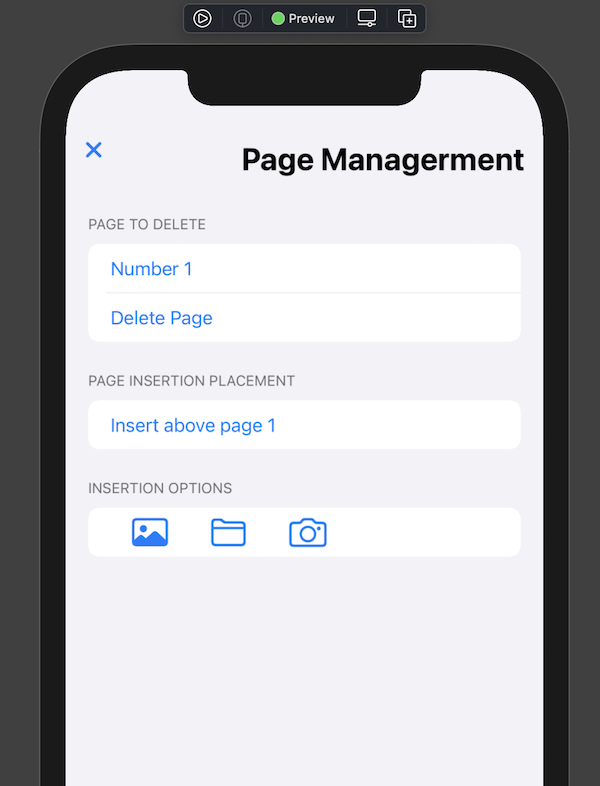
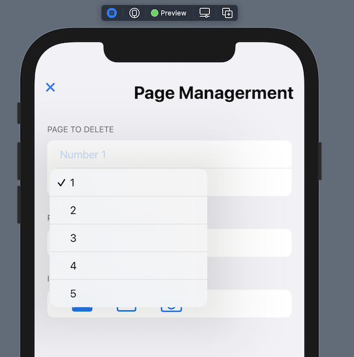
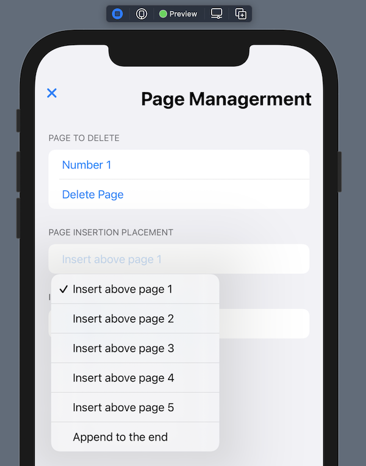

It’s time. I’ve teased this challenger for two blog posts now, and i't’s time to reveal who it is. And it is…

THE FILES APP!

Yep, there is a handy button in the Files app that will let you use the same PDF scanner I’m using to save to any place in your files, just like us. That means that, for as many taps as my app takes, you can upload the PDFs directly to whatever file or cloud service is connected to your device.

Dang it! This was exactly what I wanted, and built! So, is it all for naught? Did I make an app that does exactly what the Files app does, except that the Files app is already on the phone and iPad? Is there no more value I can offer?

Well, as so often happens, new discoveries come to light, new competitors enter during development, etc. It’s a fact of entrepreneurial life. And our little app project is no exception. Even though [Apple itself still advertises scanning via Notes](https://support.apple.com/en-us/HT210336), and although our app at least does better than that, the Files app feature is amazing.

And now for a great truism in app development:

1) Everything worth doing has been done.

2) Not everything worth doing has been done well.

3) Everything can be done better.

Often people stop at the first point and turn around. Others push forward and bring new value to the world. And that’s what we will do. We’ll create something that has people say, well yes, I could use the Apple default but it isn’t as good as PDFTrapper because ___.

So what can fill those blanks?

It could look a little nicer, and arrange things better. A better design goes a long way. And by design I don’t just mean colors and aesthetics but arranging and setting a up a flow that makes more sense, is less prone to error, and overall does a better job.

However, with our simple app, we’re probably not going to optimize the flow much more, or make design improvements that would cause someone to download the app. It’s about as simple and slimmed down as it can be.

And it isn’t pretty yet! Once everything is functional, we’ll give an aesthetics pass to make sure our app has all the best looks and feels.

(More importantly, we’ll want to give our app the best accessibility, but that will be for another time).

Even once our app looks good, aesthetics won’t be enough to sell it.

So we go to the next thing you can do: which is, simply, more. You can add more features that help the user accomplish what they want.

As awesome as the Files scanner is, there is one thing it can’t do, and which we can make our app do. It’s something significant. Something that most folks would want who do a lot of scanning.

### The new feature

We’re going to let the user delete and add more pages. It sounds so simple. But think about it. You’re doing your taxes and you’ve got several pages for one form. You scan four of them, but then, oh no! You forgot to scan one! Or you got one out of order! All you need to do is delete one here, and scan the other one here. Or maybe you forgot to scan one last page. You just need to add that last page to your already-scanned four pages.

But you can’t 😭.

You can’t because all you have is the Files scanner. And that scanner won’t let you append a page or delete a page to an existing scan. You can create a brand new PDF from a scan. That’s it. Nothing else. Now you’ve got to spend 5 times as long correcting your mistaking than you would if you only had …

PDFTrapper! Which lets users delete pages and add new pages at any point in the document!

That’s the idea. Now let’s make it happen.

### The code

First, let’s adjust our PDFManager to include the PDFTrapperDocument itself. And we’ll have a handy variable that calculates the number of pages. And we’re going to do a bit of rewriting to make our navigation handling a little more scalable, so we’ll add an enum for the different ways we can add pages, and the different views that can be available to us on the main screen. And finally we’ll have a “pageNumberForInsertion” that we’ll use if one of “AddPDFOption” is active.

Long story short, the code now looks like this:

```
`import Combine
import PDFKit
import SwiftUI

class PDFManager: ObservableObject {
    enum PDFTrapperNavigation {
        case showEditor
        case showScanner
        case showPDFMain
        case showAddRemovePages
        case refreshing
    }

    enum AddPDFOption {
        case photoRoll
        case file
        case camera
        case none
    }

    var document: PDFTrapperDocument?

    @Published var pageNumberForInsertion = 0
    @Published var addPDFOption: AddPDFOption = .none

    @Published var navigation: PDFTrapperNavigation = .showPDFMain

    var saveReporter = PassthroughSubject<Void, Never>()
    var startEditMode = PassthroughSubject<Void, Never>()

    var pageCount: Int {
        document?.pdf.pageCount ?? 0
    }

    func addPhotos(_ photos: [UIImage]) {
        guard let pdfTrapperDocument = document else {
            return
        }

        let pages = photos.compactMap { PDFPage(image: $0) }

        if addPDFOption == .camera {
            for i in 0 ..< pages.count {
                pdfTrapperDocument.pdf.insert(pages[i], at: pageNumberForInsertion + i)
            }
        }

        if pdfTrapperDocument.isBlank {
            // Remove the default blank page
            pdfTrapperDocument.pdf.removePage(at: 0)

            for i in 0 ..< pages.count {
                pdfTrapperDocument.pdf.insert(pages[i], at: i)
            }
        }

        if !pages.isEmpty {
            save()
        }
    }

    func delete(page: Int) {
        guard let document = document else {
            return
        }

        document.pdf.removePage(at: page - 1)
        save()
    }

    func save() {
        saveReporter.send()
    }
}`
```

  Now we’ll make our view to add and remove pages. We’ll use Picker to choose what page to delete and what insertion index to use.

And we’ll adjust the text to make our index’s understandable to normal people. So the last index can be “Append to the end of document” and such, instead of just the count. And we’ll increment the index by one to represent the page number.

We’ll use a Form view to fit in nicely with the system utility aesthetic.

The code looks like this:

```
`import SwiftUI

struct AddRemovePagesView: View {
    var pageCount: Int

    @ObservedObject var manager: PDFManager
    @State var pageToDelete = 1

    var pageToDeleteString: String {
        NumberFormatter.localizedString(from: NSNumber(integerLiteral: pageToDelete), number: .none)
    }

    var pageToInsertString: String {
        text(forOption: manager.pageNumberForInsertion)
    }

    func text(forOption option: Int) -> String {
        if option == pageCount {
            return "Append to the end"
        }

        let generalPage = NumberFormatter.localizedString(from: NSNumber(integerLiteral: option + 1), number: .none)

        return "Insert above page " + generalPage
    }

    var body: some View {
        VStack {
            HStack(alignment: .top) {
                Button(action: {
                    withAnimation {
                        manager.navigation = .showPDFMain
                    }
                }) {
                    Image(systemName: "xmark")
                        .font(Font.body.weight(.bold))
                }
                Spacer()
                Text("Page Managerment")
                    .font(.title)
                    .bold()
            }
            .padding()
            Form {
                Section(header: Text("Page to delete")) {
                    Picker("Number \(pageToDeleteString)", selection: $pageToDelete) {
                        ForEach(1...pageCount, id: \.self) { value in
                            Text("\(value)").tag(value)
                        }

                    }
                    .pickerStyle(MenuPickerStyle())
                    Button("Delete Page") {
                        manager.delete(page: pageToDelete)
                    }
                }
                Section(header: Text("Page insertion placement")) {
                    Picker(pageToInsertString, selection: $manager.pageNumberForInsertion) {
                        ForEach(0...pageCount, id: \.self) { value in
                            Text(text(forOption: value)).tag(value)
                        }
                    }
                    .pickerStyle(MenuPickerStyle())
                }
                Section(header: Text("Insertion options")) {
                    HStack(spacing: 32) {
                        Button(action: {
                            manager.addPDFOption = .photoRoll
                        }) {
                            Image(systemName: "photo")
                                .font(.title)
                        }
                        Button(action: {
                            manager.addPDFOption = .file
                        }) {
                            Image(systemName: "folder")
                                .font(.title)
                        }
                        Button(action: {
                            manager.addPDFOption = .camera
                            manager.navigation = .showScanner
                        }) {
                            Image(systemName: "camera")
                                .font(.title)
                        }
                    }
                    .padding(.horizontal)
                }
            }
        }
        .background(Color(.systemGroupedBackground).ignoresSafeArea())

    }
}`
```

  And that gives us:

        

        

        

  Awesome.

And one more thing to do is to move our controls, the buttons to edit and manage PDF pages, to a new view. It looks like this:

```
`import SwiftUI

struct PDFMainControls: View {
    @ObservedObject var manager = PDFManager()
    var body: some View {
        HStack {
            Button("Editing Canvas") {
                withAnimation {
                    manager.navigation = .showEditor
                }
                DispatchQueue.main.asyncAfter(deadline: .now() + 0.3) {
                    manager.startEditMode.send()
                }
            }
            Button("Add/Remove Pages") {
                withAnimation {
                    manager.navigation = .showAddRemovePages
                }
            }
        }
    }
}`
```

  And finally we adjust our ContentView with several improvements.

```
`import Combine
import PDFKit
import SwiftUI

struct ContentView: View {
    @StateObject var manager = PDFManager()
    @Binding var document: PDFTrapperDocument
    var fileURL: URL?

    private func save() {
        document.setAsNotBlank()
        document.saveTrigger.toggle()

       refresh()
    }

    private func refresh() {
        withAnimation {
            manager.navigation = .refreshing
        }

        DispatchQueue.main.asyncAfter(deadline: .now() + 0.3) {
            manager.navigation = .showPDFMain
        }
    }

    var body: some View {
        ZStack {
            if let url = fileURL {
                QuickLookController(startEditing: manager.startEditMode, url: url) {
                    if let refreshedPDF = PDFDocument(url: url) {
                        document.pdf = refreshedPDF
                        save()
                    }
                }
                .opacity(0)
            }
            switch manager.navigation {
            case .showPDFMain:
                if !document.isBlank {
                    VStack {
                        PDFDisplayView(pdf: document.pdf)
                        PDFMainControls(manager: manager)
                    }
                }                
            case .showScanner:
                ScannerView { images in
                    manager.addPhotos(images)
                }
            case .showAddRemovePages:
                AddRemovePagesView(pageCount: manager.pageCount, manager: manager)
            case .refreshing, .showEditor:
                ProgressView()
            }
        }
        .onAppear {
            manager.document = document
            if document.isBlank {
                withAnimation {
                    manager.navigation = .showScanner
                }
            }
        }
        .onReceive(manager.saveReporter, perform: save)
    }
}`
```

  One thing we’ve done here is added the different sections in a handy switch statement. However, we don’t include the QuickLookController. That’s because we want the QuickLookController to always be available to push the actual preview controller, and the QuickLookController is invisible.

Another excellent thing we’ve done is attach a refresh mechanism, so that whenever we save our document, the first thing that happens is that we get a progress view and a fade, and that gives our app time to refetch the edited PDF.

That gives us this!

Adding and deleting PDF pages.

  Awesome, everything is working!

You may notice that there is filler for choosing a photo via the image picker and via the document picker. I leave these for you to implement on your own. My strategy: the same as the QuickLookController: rather than wrapping the views directly, have the UIDocumentPickerViewController and the UIImagePickerController be pushed by an invisible view controller so that more of the appropriate UIKit environment is around them.

If you missed this novel, but pro way of wrapping specialty view controllers in SwiftUI, [checkout my last post here](https://www.cephalopod.studio/blog/pdf-capture-app-part-4-swiftui-pro-tip-amp-pdf-editing). 

### Next Steps

Now we have an app that is more convenient and efficient than Notes, as capable as Files, and with more helpful features than Files.

So, is it time to actually make the app look good?

Getting close, but now that we’re here, let’s do something really cool. And I mean, it’s the kind of feature that people actually subscribe to high-priced apps for because, up until recently, it has been really hard to do.

What is that feature? Tune in next time! And hit me up at [wattmaller1](https://twitter.com/wattmaller1) on Twitter for thoughts and suggestions! Until next time, happy coding.