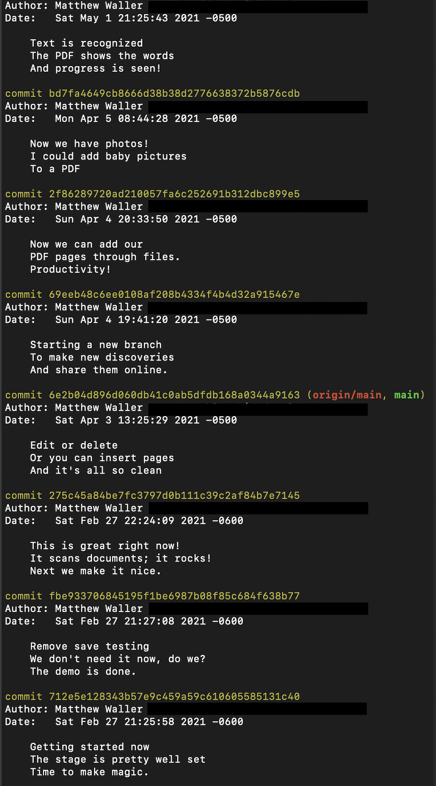

## Summary

We’ve reached the end, and to summarize, here is a little git log. And they’re all written as haiku. Five syllables, then seven syllables, then five syllables.

        

  Let’s summarize each one.

> [Getting started now](https://www.cephalopod.studio/blog/making-a-pdf-capture-app-part-1)

[The state is pretty well set](https://www.cephalopod.studio/blog/making-a-pdf-capture-app-part-1)

[Time to make magic](https://www.cephalopod.studio/blog/making-a-pdf-capture-app-part-1)

With that one we created our initial PDF creation and viewing.

> [Remove save testing](https://www.cephalopod.studio/blog/making-a-pdf-capture-app-part-2)

[We don’t need it now, do we?](https://www.cephalopod.studio/blog/making-a-pdf-capture-app-part-2)

[The demo is done.](https://www.cephalopod.studio/blog/making-a-pdf-capture-app-part-2)

With that we persisted our PDF and changes to it.

> [This is great right now!](https://www.cephalopod.studio/blog/making-pdf-capture-app-part-3)

[It scans documents; it rocks!](https://www.cephalopod.studio/blog/making-pdf-capture-app-part-3)

[Next we make it nice.](https://www.cephalopod.studio/blog/making-pdf-capture-app-part-3)

With that we started saving actual documents! And it already proved to be more efficient than the notes app!

> [Edit or delete](https://www.cephalopod.studio/blog/pdf-capture-app-part-4-swiftui-pro-tip-amp-pdf-editing)

[Or you can insert pages](https://www.cephalopod.studio/blog/pdf-capture-app-part-4-swiftui-pro-tip-amp-pdf-editing)

[And it’s all so clean](https://www.cephalopod.studio/blog/pdf-capture-app-part-4-swiftui-pro-tip-amp-pdf-editing)

With that we did our editing pages so that you can draw on them, add text annotations, or even add signatures! Also a bit of code combined in there that can delete and insert pages from a later post

> Starting a new branch

To make new discoveries

And share them online.

Nothing to see here. Reorganizing, adjusting branches.

> [Now we can add our](https://www.cephalopod.studio/blog/pdf-capture-app-part-5-defeating-the-boss)

[PDF pages through files.](https://www.cephalopod.studio/blog/pdf-capture-app-part-5-defeating-the-boss)

[Productivity!](https://www.cephalopod.studio/blog/pdf-capture-app-part-5-defeating-the-boss)

With that we finish the edit or delete pages bit, meaning that not only are we a step ahead of the Notes app in terms of efficiency and features for PDFs, we’re also ahead of the Files app because we can let the user append and delete pages. We’re now surpassed the built-in app competition.

> Now we have photos!

I could add baby pictures

To a PDF

This is me doing extra credit. Now I can add existing PDFs and image through Files, and through the camera roll.

> [Text is recognized](https://www.cephalopod.studio/blog/making-a-pdf-capture-app-part-6-endgame)

[The PDF shows the words](https://www.cephalopod.studio/blog/making-a-pdf-capture-app-part-6-endgame)

[And progress is seen!](https://www.cephalopod.studio/blog/making-a-pdf-capture-app-part-6-endgame)

Finally we add an awesome feature and a flourish: high-quality OCR in our PDF scanner. Awesome.

## Epilogue

So, release the app next week eh?

Not so fast. There is a lot to do. First, I would want to make it look presentable. We’re only got three buttons and a form to adjust, but to get those right and add appropriate accessibility and really craft them out can take a lot of worthwhile time, so we’ll do that.

And then we’ve got all the sad-face paths. We’re got the happy paths, and now we need to decide what to do if things go wrong. What if a PDF already has text? What if users want to redo the text recognition? What if they want to cancel recognition? What if they try recognizing and no text gets recognized? What if an editing error occurs?

And then the testing. We want to be able to debug and refactor and maybe add new features without breaking the app. So all of this need thorough testing, both unit tests and UI tests. The whole bit.

Only then do we work on submittal and marketing and so on. We’ve come a long way and there is still plenty to do.

Including undoing what I may have done wrong! I’m still not sure my persistence schemes are the best. Or maybe I shouldn’t save in place with the preview controller and should request a copy of the object instead. Lots to think about as we discover more about DocumentGroup and the like.

Regardless, I hope you’ve found this series interesting or useful, and that you might have ideas of your own about where you can go with this. Until next time, happy coding.