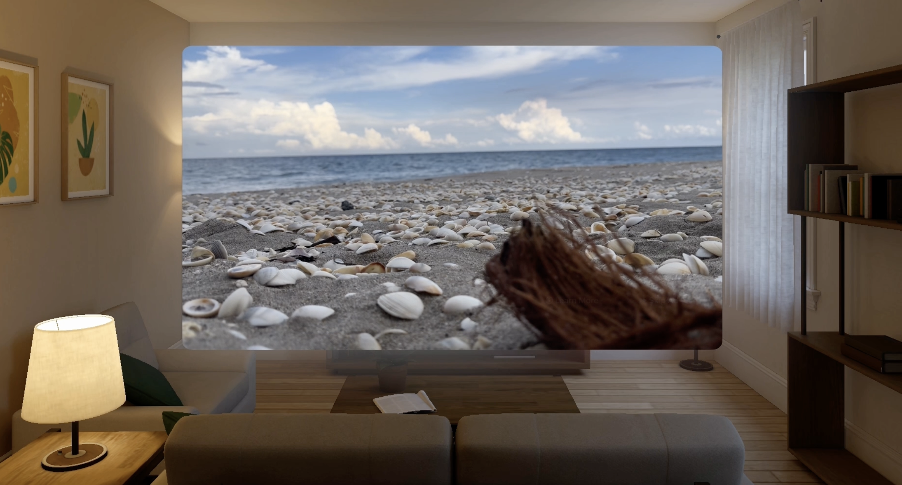

 

  This was a risky move, but so far, it’s a good one.

Our app [Passage](https://apps.apple.com/us/app/flowriter-writers-retreat/id6470159510) has a feature where you can create immersive environments in the form of AI-generated, 360 images. That means we have an ongoing cost, and that means a subscription.

Seems straightforward enough.

Then the good folks at [AdXR](https://www.adxr.io) approached us about using ads. Absolutely not, I thought. I’ve seen those dystopian videos where people wearing AR glasses are drowning in ads, so at first, I brushed it off. I did like the overall philosophy of AdXR though, which doesn’t do tracking in its ads and is more like a return to brand advertising. But still, ads in in the headset?

### An epiphany

And then, while I was waiting the usually 30 seconds for my world to appear in Passage I thought, hang on, this could work. Subscription fatigue is real, and this is a pretty natural place to put an ad.

So I worked out that, if you’re not subscribed, you could see an ad. And it wouldn’t appear out of nowhere. I would have it right on the button that if you generate a world you would see an ad. Front and center. No surprise popups while you’re doing things or anything like that.

I covered this thought process in more detail in [a previous blogpost](/blog/embedding-ads-on-a-vision-pro-app), including going over what I consider to be best practices, but here is something I haven’t revealed, something I got permission to share: the rates on the ads are insane. $1 per glance.

### Solid returns

I had used ads on mobile before, and you’re lucky to get a few cents per thousand impressions. This was orders of magnitudes better. It actually helps cover the API costs. And the AdXR folks were true to their word: we’ve made about $200 per month in the three months we implemented ads in our humble app. So many apps make nothing as far as sales. It’s such a good deal. And it helps get out of the subscription fatigue folks are feeling, in my estimation.

It’s still early days. Rates can change. It will be up to the advertising agencies’ clients to decide whether the investment on their part is worthwhile, but for developers, at this stage, it’s a great deal. And they’re not opening it up to just anyone. You have to apply, and it’s not an anonymous system (which is wise; you can imagine how folks might abuse the system at this juncture). And full disclosure, they’ve got an informal referral program going, so tell them we sent you if you end up applying.

I’m very pleased with how the ads setup has gone thus far. Here’s hoping for a good ad setup for everyone involved, from the people using the app, to the clients, to us, the devs.