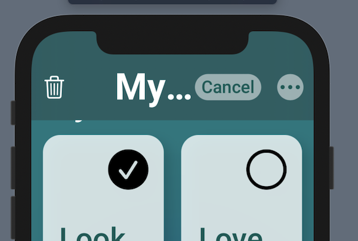
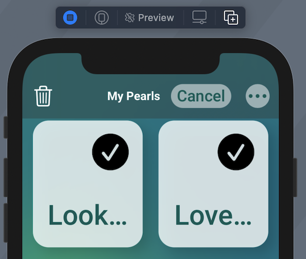

In my post about [making a really cool aurora background](https://www.cephalopod.studio/blog/swiftui-aurora-background-animation) I had a section on adjusting for accessibility. I’ve since reconsidered what I wrote and wanted to share more about what I’ve learned.

### Rethinking Our Steps

The first setting I adjusted for in my morphing, animating background is called reducedMotion.

The guidelines for motion are worth looking at in full:
This is from [Apple’s Human Interface Guidelines](https://developer.apple.com/design/human-interface-guidelines/accessibility/overview/appearance-effects/#motion):

**Motion**

Don’t require animations unless they’re vital to your app’s purpose. In general, people should be able to use your app without relying on any animations.

Play tightened animations when Reduce Motion is on. People can turn on Reduce Motion if they tend to get distracted or experience dizziness or nausea when viewing animations that include effects such as zooming, scaling, spinning, or peripheral motion. In response to this setting, consider tightening the physics of your animations so that they remain rich and engaging, but have reduced motion. For example:

Tighten springs to reduce bounce effects or track 1:1 with the user’s finger
Avoid animating depth changes in z-axis layers
Avoid animating into or out of blurs
Replace a slide with a fade to avoid motion
Let people control video and other motion effects. Avoid autoplaying video or effects without also providing a button or other way to control them.

Be cautious when displaying moving or blinking elements. Although subtle movement and blinking can draw the user’s attention, these effects can also be distracting and they aren’t useful for people with visual impairments. Worse, some blinking elements can cause epileptic episodes. In all cases, avoid using movement and blinking as the only way to convey information.

  So, stopping the shapes from animating in our aurora background was the right way to go! Yay!

What about reducedTransparency? Last time I wrote:

"Technically our blur is not a transparency, but it gives off the same feel and requires more device calculations behind the scene, so we’ll go ahead and disable it.

However, the circles without the blur don’t look that great. Instead of just disabling the blur and the transparencies within the colors, let’s do something special for the user and provide a unique gradient. And we’ll have it go from top leading to bottom trailing so that it isn’t too plain."

  From the Human Interface Guidelines (HIG) again:

"**Change blurring and transparency when users turn on Reduce Transparency**. For example, areas of blurred content and translucency should become mostly opaque. For best results, use a color value in the opaque area that’s different from the original color value you used when the area was blurred or translucent."

  So, it doesn’t mean that we remove all transparency. And it means we should re-examine colors.

Again, I think we made the right decision.

It’s really the last area I gave the biggest rethink: accessibilityDifferentiateWithoutColor. The documentation for this property states: 

If this property is YES, the user interface avoids conveying information using color alone. Instead, use shapes or glyphs to convey important information.

  I turned the background into solid colors, but was this necessary? Our designers kept colorblindness in mind when making the designs and, most importantly, we’re not conveying any state information. The background is mostly aesthetic, meant to contribute to the mood and feel of the app. So, in this case, for our background we will ignore this property.

### Reduced Means Reduced

Just something else to keep in mind as I made changes for things like headers in the Pearl app. If you have a color with opacity, you can make it more solid and adjust the color for things like reduced transparency. And if a button fades in slightly (like the trash icon when a deletion option becomes available), this isn’t really an animation that needs to be completely avoided in the course of making an app. 

Reduced means reduced. We can make animations tighter where necessary, for instance. In general, we keep the end goals in mind of making the user not feel confused, dizzy, or nauseous. 

### Large Text Adjustments

I ran into a bunch of troubles getting the built-in SwiftUI Navigation bar to behave exactly as I wanted it to. I wanted buttons that were a bit more custom, and I wanted to fade in those buttons, and the navigation bar was giving me a tough time. I couldn’t animate anything in that bar! 

But I also really liked the large title fading into the inline title. And I didn't need to worry about much actual navigating, my other screens presented are presented modally, so without too much trouble I recreated the navigation bar experience in concert with my LazyVGrid.

  Not bad so far. What does it look like with the largest text enabled? With the trash icon enabled?

        

  Goodness, there is not way “My Pearls” is going to fit. So, what does Apple do in these instances (generally a pretty helpful question; and we can pull out first-party apps and take a look).

It turns out that the text doesn’t grow to a full size very often. So We can use fixed size here.

        

  Well, now it fits, but there is still something missing. We don’t want to leave our large text accessibility users in a lurch if they’re wondering what that tiny text says. So again, let’s do what Apple does! There is a great tool called UILargeContentViewerInteraction. You can learn more about this in this [great WWDC session](https://developer.apple.com/videos/play/wwdc2019/261/) and [in this blog post](https://www.fivestars.blog/articles/large-content-viewer/).

Unfortunately, in our SwiftUI app, there isn’t a way to access it. I even tried wrapping a UILabel in UIViewRepresentable and UIViewControllerRepresentable, setting all the things and, no dice. So I filed my Feedback and started thinking.

What does the software developer do when the Suez Canal is blocked? We build a new canal! 

So I made my own version of the feature as a holdover.

First I created an accessibilityAdjuster.

```
`import Combine
import SwiftUI

class AccessibilityAdjuster: ObservableObject {
    @Published var largeContentViewerText: String? = nil
    // Other things ...
}`
```

  I’ve got a bunch of stuff in here to make adjustments, like changing the size of my grid to make room for the larger text and so on, but I’m keeping that away for now. What I did for this was add my published text.

Then as the last view in the ZStack where I show my custom navigation header I have:

```
`if let largeText = adjuster.largeContentViewerText {
                ZStack {
                    Text(largeText)
                        .foregroundColor(.white)
                        .padding()
                }
                .background(Theme.generalBackground.clipShape(RoundedRectangle(cornerRadius: 12)).shadow(radius: 10))

            }`
```

  If the text is there, show it in white in large accessibility body, the default, with my theme’s general background color, which is dark in both light and dark mode. And round the corners of the background.

The text that people can tap on to see the bigger version looks like this:

```
`import SwiftUI

struct HeaderTitle: View {
    @EnvironmentObject var adjuster: AccessibilityAdjuster
    @Environment(\.sizeCategory) var category
    @GestureState private var isTapped = false
    var isInline: Bool
    var body: some View {
        Text(Words.pearls)
            .lineLimit(1)
            .font(.custom("Roboto-Bold", fixedSize: 18))
            .foregroundColor(Theme.lightTitle)
            .opacity(isInline ? 1 : 0)
            .animation(.linear(duration: 0.2))
            .gesture(DragGesture(minimumDistance: 0).updating($isTapped, body: { _, _, _ in
                switch category {
                case .accessibilityMedium,
                     .accessibilityLarge,
                     .accessibilityExtraLarge,
                     .accessibilityExtraExtraLarge,
                     .accessibilityExtraExtraExtraLarge:
                    adjuster.largeContentViewerText = Words.pearls
                default:
                    break
                }
            }).onEnded({ _ in
                adjuster.largeContentViewerText = nil
            }))
    }
}`
```

  Here I have my custom font at a fixed size, and in the case of accessibility font sizes, I set the value to Words.pearls, which is the static variable of a struct that contains a reference to the “My Pearls” string.

When the gesture ends, we set it back to nil.

(The “isInline” stuff is to manage the transition for large title to inline title).

Now it looks like this!

Tapping and holding twice to make the homemade UILargeContentViewerInteraction to appear.

  Awesome! Still looks a little weird to have the small “My Pearls” text off-center, so I may adjust that for the large accessibility size, but not bad overall.

As always, feel free to [jump into the beta of Pearl](https://www.cephalopod.studio/work/pearl). I’m hoping to have the redesign work I showed off in my aurora post and here working soon for iOS and iPad (and then we make it look good for the non-Catalyst SwiftUI Mac version!).

Thanks again y’all, and happy coding.