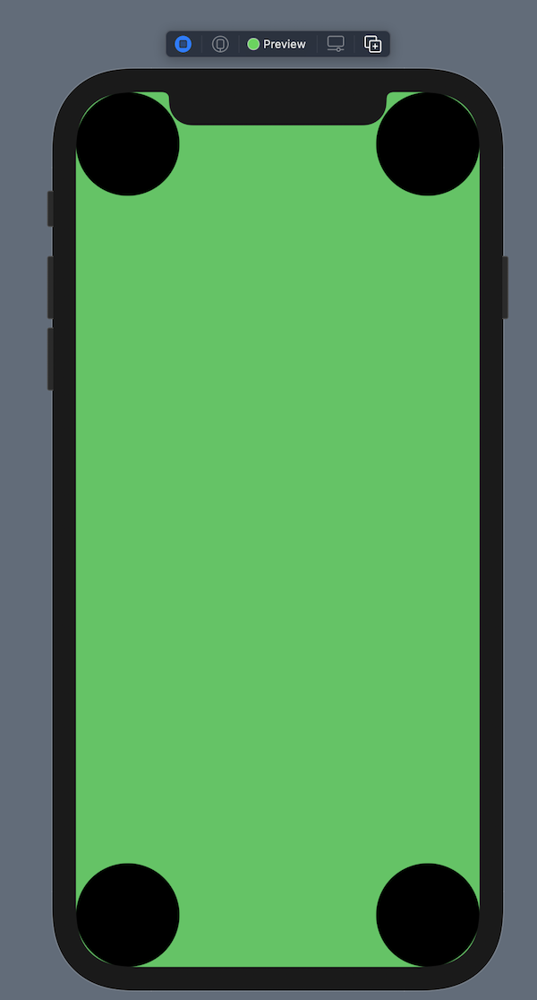
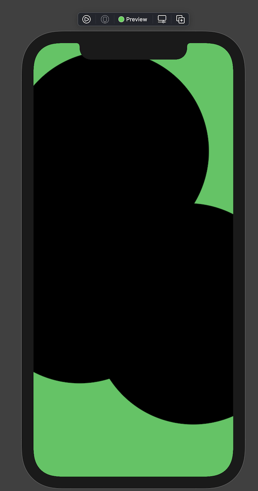
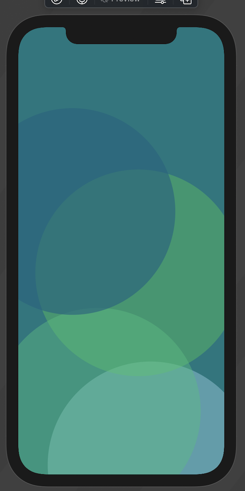
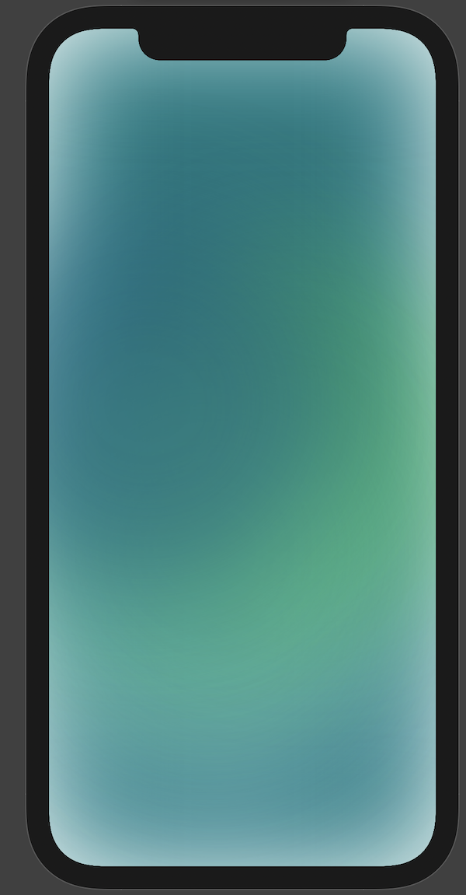
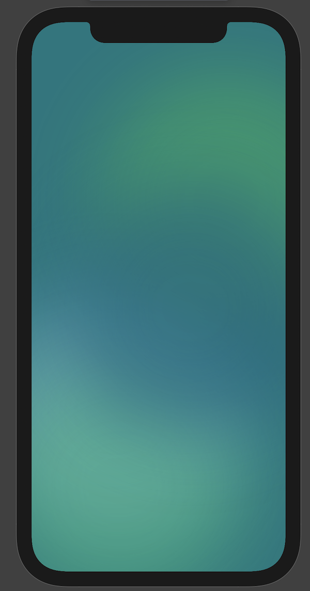
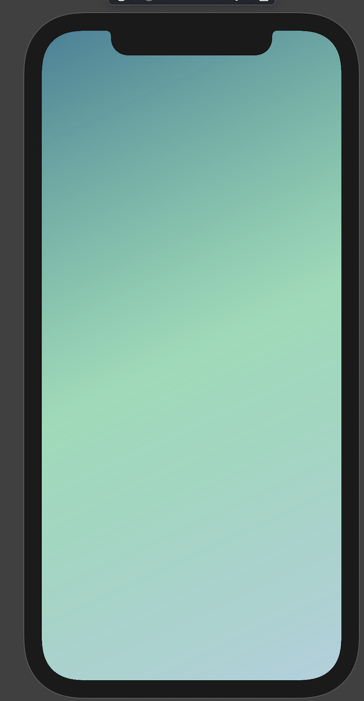
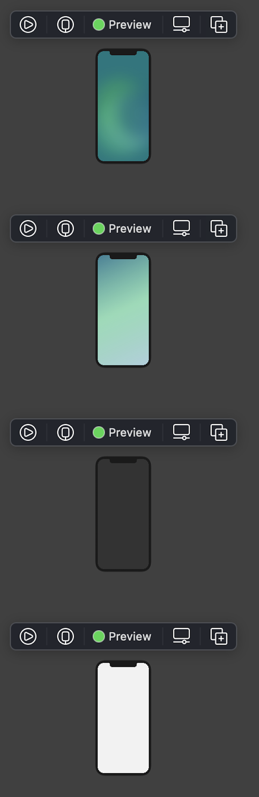

Lately I’ve been working on [my well-being app Pearl](https://www.cephalopod.studio/work/pearl). I’m going through a redesign with the help of my friends Joel and Jillian at [Return Technologies](https://return.team)! And I was interested in making a beautiful gradient background. Something using a sort of [aurora design](https://uxdesign.cc/aurora-ui-new-visual-trend-for-2021-c763a7daa7e2).

What we have in SwiftUI are some excellent gradient helpers: Linear, Radial, Conical. They are all really cool! But I was wanting to put something together that is more organic. And Joel and Jillian brought up the point that it could look really nice animated.

My strategy: add multi-colored, animating shapes and apply a blur, which was essentially how the Figma specs were made.

So, let’s make a beautiful aurora background with great accessibility to boot!

### The Shapes

First, I’m going to put my shapes on the screen. I’ll just go with circles for now. I’m going to put each one in a quadrant of the screen.

I do this by putting all my circles in a ZStack and giving each circle two frames: one frame for the size, and one to expand the circle’s area to the size of the screen, with an alignment to put it in the right corner.

```
`import SwiftUI

struct ContentView: View {

    var body: some View {
        FloatingClouds()
    }
}

struct Cloud: View {
    let alignment: Alignment
    var body: some View {
        Circle()
            .frame(width: 100, height: 100)
            .frame(maxWidth: .infinity, maxHeight: .infinity, alignment: alignment)
    }
}

struct FloatingClouds: View {
    var body: some View {
        ZStack {
            Color.green
            Cloud(alignment: .topLeading)
            Cloud(alignment: .topTrailing)
            Cloud(alignment: .bottomLeading)
            Cloud(alignment: .bottomTrailing)
        }
        .ignoresSafeArea()
    }
}

struct ContentView_Previews: PreviewProvider {
    static var previews: some View {
        ContentView()
    }
}`
```

        

  Awesome. Now, we want our circles to have some random sizes and offsets, for the organic look. And we want those sizes to fit in with the size of the screen, so that this works with iPhone, iPad and Mac. For that we’ll need GeometryReader.

We also want our randomization to not be decided in the view, so that when the view is recalculated we don't randomize all over again and stutter all the time. So we’ll but our randomization in an object that will get created once and then reused. Yep, we’ll use an ObservableObject. And let’s call it CloudProvider, for kicks.

```
`struct Cloud: View {
    @StateObject var provider = CloudProvider()
    let alignment: Alignment
    let proxy: GeometryProxy
    var body: some View {
        Circle()
            .frame(height: proxy.size.height /  provider.frameHeightRatio)
            .offset(provider.offset)
            .frame(maxWidth: .infinity, maxHeight: .infinity, alignment: alignment)
    }
}

class CloudProvider: ObservableObject {
    let offset: CGSize
    let frameHeightRatio: CGFloat
    init() {
        frameHeightRatio = CGFloat.random(in: 0.7 ..< 1.4)
        offset = CGSize(width: CGFloat.random(in: -150 ..< 150),
                        height: CGFloat.random(in: -150 ..< 150))
    }
}

struct FloatingClouds: View {
    var body: some View {
        GeometryReader { proxy in
            ZStack {
                Color.green
                Cloud(alignment: .topLeading, proxy: proxy)
                Cloud(alignment: .topTrailing, proxy: proxy)
                Cloud(alignment: .bottomLeading, proxy: proxy)
                Cloud(alignment: .bottomTrailing, proxy: proxy)
            }
            .ignoresSafeArea()
        }
    }
}`
```

        

  Okay, not much to look at here. Now is the time to add the design’s colors!

```
`struct Theme {
    static var generalBackground: Color {
        Color(red: 0.043, green: 0.467, blue: 0.494)
    }

    static func ellipsesTopLeading(forScheme scheme: ColorScheme) -> Color {
        let any = Color(red: 0.039, green: 0.388, blue: 0.502, opacity: 0.81)
        let dark = Color(red: 0.000, green: 0.176, blue: 0.216, opacity: 80.0)
        switch scheme {
        case .light:
            return any
        case .dark:
            return dark
        @unknown default:
            return any
        }
    }

    static func ellipsesTopTrailing(forScheme scheme: ColorScheme) -> Color {
        let any = Color(red: 0.196, green: 0.796, blue: 0.329, opacity: 0.5)
        let dark = Color(red: 0.408, green: 0.698, blue: 0.420, opacity: 0.61)
        switch scheme {
        case .light:
            return any
        case .dark:
            return dark
        @unknown default:
            return any
        }
    }

    static func ellipsesBottomTrailing(forScheme scheme: ColorScheme) -> Color {
        Color(red: 0.541, green: 0.733, blue: 0.812, opacity: 0.7)
    }

    static func ellipsesBottomLeading(forScheme scheme: ColorScheme) -> Color {
        let any = Color(red: 0.196, green: 0.749, blue: 0.486, opacity: 0.55)
        let dark = Color(red: 0.525, green: 0.859, blue: 0.655, opacity: 0.45)
        switch scheme {
        case .light:
            return any
        case .dark:
            return dark
        @unknown default:
            return any
        }
    }
}`
```

  And then we adjust the circles like so:

```
`struct Cloud: View {
    @StateObject var provider = CloudProvider()
    let alignment: Alignment
    let proxy: GeometryProxy
    let color: Color
    var body: some View {
        Circle()
            .fill(color)
            .frame(height: proxy.size.height /  provider.frameHeightRatio)
            .offset(provider.offset)
            .frame(maxWidth: .infinity, maxHeight: .infinity, alignment: alignment)
    }
}

struct FloatingClouds: View {
    @Environment(\.colorScheme) var scheme

    var body: some View {
        GeometryReader { proxy in
            ZStack {
                Theme.generalBackground
                Cloud(alignment: .bottomTrailing,
                      proxy: proxy,
                      color: Theme.ellipsesBottomTrailing(forScheme: scheme))
                Cloud(alignment: .topTrailing,
                      proxy: proxy,
                      color: Theme.ellipsesTopTrailing(forScheme: scheme))
                Cloud(alignment: .bottomLeading,
                      proxy: proxy,
                      color: Theme.ellipsesBottomLeading(forScheme: scheme))
                Cloud(alignment: .topLeading,
                      proxy: proxy,
                      color: Theme.ellipsesTopLeading(forScheme: scheme))

            }
            .ignoresSafeArea()
        }
    }
}`
```

        

Now we’re getting somewhere!

### The Animation

Now we have our clouds. How could we make them animate and float around?

Well, the trick here is to add an offset first. This will move the circle away from a center. Then we can apply a rotation animation. So that way it will be like the circle is rotating around that offset center. And that’s how we can make the circles rotate in a circular pattern in their quadrant.

We also want to give a starting point on that rotation path. And a different speed for each circle. It’s a little like making a solar system!

(I’ll also adjust to opacity of each circle for softer colors)

```
`class CloudProvider: ObservableObject {
    let offset: CGSize
    let frameHeightRatio: CGFloat

    init() {
        frameHeightRatio = CGFloat.random(in: 0.7 ..< 1.4)
        offset = CGSize(width: CGFloat.random(in: -150 ..< 150),
                        height: CGFloat.random(in: -150 ..< 150))
    }
}

struct Cloud: View {
    @StateObject var provider = CloudProvider()
    @State var move = false
    let proxy: GeometryProxy
    let color: Color
    let rotationStart: Double
    let duration: Double
    let alignment: Alignment

    var body: some View {
        Circle()
            .fill(color)
            .frame(height: proxy.size.height /  provider.frameHeightRatio)
            .offset(provider.offset)
            .rotationEffect(.init(degrees: move ? rotationStart : rotationStart + 360) )
            .animation(Animation.linear(duration: duration).repeatForever(autoreverses: false))
            .frame(maxWidth: .infinity, maxHeight: .infinity, alignment: alignment)
            .opacity(0.8)
            .onAppear {
                move.toggle()
            }
    }
}

struct FloatingClouds: View {
    @Environment(\.colorScheme) var scheme

    var body: some View {
        GeometryReader { proxy in
            ZStack {
                Theme.generalBackground
                Cloud(proxy: proxy,
                      color: Theme.ellipsesBottomTrailing(forScheme: scheme),
                      rotationStart: 0,
                      duration: 60,
                      alignment: .bottomTrailing)
                Cloud(proxy: proxy,
                      color: Theme.ellipsesTopTrailing(forScheme: scheme),
                      rotationStart: 240,
                      duration: 50,
                      alignment: .topTrailing)
                Cloud(proxy: proxy,
                      color: Theme.ellipsesBottomLeading(forScheme: scheme),
                      rotationStart: 120,
                      duration: 80,
                      alignment: .bottomLeading)
                Cloud(proxy: proxy,
                      color: Theme.ellipsesTopLeading(forScheme: scheme),
                      rotationStart: 180,
                      duration: 70,
                      alignment: .topLeading)
            }
            .ignoresSafeArea()
        }
    }
}`
```

Video of circles animating

  Not bad! Kind of a lava lamp feel. Very floaty and peaceful, what I’m going for. You’ll notice I also hard coded some things on initialization: the speed and rotation start. That’s because, while randomization can be really cool and helpful, it doesn’t alway aesthetically produce the best results, so I’ve done some guiding that should still translate well to other platforms.

### The Blur

This part, you might think, is easy. Just put your shapes behind a UIVisualEffectView, which is easy to wrap in SwiftUI. 

Well, I tried it. And the blur was too intense for all the styles I tried, and the colors too muddled. I would need to think of something else.

So instead, I’m using .blur in SwiftUI.

.blur isn’t the same thing as UIVisualEffectView. What it does is apply a gaussian blur. It makes the edges fuzzy! So it won’t work to provide blur as a window to things underneath, the way UIVisualEffectView does.

First I used it on the whole background like this:

```
`struct FloatingClouds: View {
    @Environment(\.colorScheme) var scheme
    let blur: CGFloat = 60

    var body: some View {
        GeometryReader { proxy in
            ZStack {
                Theme.generalBackground
                Cloud(proxy: proxy,
                      color: Theme.ellipsesBottomTrailing(forScheme: scheme),
                      rotationStart: 0,
                      duration: 60,
                      alignment: .bottomTrailing)
                Cloud(proxy: proxy,
                      color: Theme.ellipsesTopTrailing(forScheme: scheme),
                      rotationStart: 240,
                      duration: 50,
                      alignment: .topTrailing)
                Cloud(proxy: proxy,
                      color: Theme.ellipsesBottomLeading(forScheme: scheme),
                      rotationStart: 120,
                      duration: 80,
                      alignment: .bottomLeading)
                Cloud(proxy: proxy,
                      color: Theme.ellipsesTopLeading(forScheme: scheme),
                      rotationStart: 180,
                      duration: 70,
                      alignment: .topLeading)
            }
            .blur(radius: blur)
            .ignoresSafeArea()
        }
    }
}`
```

  But that cause too much transparency along the edges. See here:

        

  What works better is to only blur the circles. Like this:

```
`struct FloatingClouds: View {
    @Environment(\.colorScheme) var scheme
    let blur: CGFloat = 60

    var body: some View {
        GeometryReader { proxy in
            ZStack {
                Theme.generalBackground
                ZStack {
                    Cloud(proxy: proxy,
                          color: Theme.ellipsesBottomTrailing(forScheme: scheme),
                          rotationStart: 0,
                          duration: 60,
                          alignment: .bottomTrailing)
                    Cloud(proxy: proxy,
                          color: Theme.ellipsesTopTrailing(forScheme: scheme),
                          rotationStart: 240,
                          duration: 50,
                          alignment: .topTrailing)
                    Cloud(proxy: proxy,
                          color: Theme.ellipsesBottomLeading(forScheme: scheme),
                          rotationStart: 120,
                          duration: 80,
                          alignment: .bottomLeading)
                    Cloud(proxy: proxy,
                          color: Theme.ellipsesTopLeading(forScheme: scheme),
                          rotationStart: 180,
                          duration: 70,
                          alignment: .topLeading)
                }
                .blur(radius: blur)
            }
            .ignoresSafeArea()
        }
    }
}`
```

  That gives you this:

        

  And finally we apply the animation and we get …

Animation with the blur applied.

  Awesome, we’ve got a mesmerizing and calming animation for the well being app. Now to make sure it’s accessible!

### Accessibility

As you can see, we’ve already adjusted our accessibility for light mode and dark mode. So that’s nice.

Now we need to respect reduced motion. We’ll add a check to decide whether we should trigger the animation. We’ll use [the clever trick here](https://www.hackingwithswift.com/books/ios-swiftui/supporting-specific-accessibility-needs-with-swiftui).

```
`func withOptionalAnimation<Result>(_ animation: Animation? = .default, _ body: () throws -> Result) rethrows -> Result {
    if UIAccessibility.isReduceMotionEnabled {
        return try body()
    } else {
        return try withAnimation(animation, body)
    }
}`
```

  We can use that as a global function and use it anywhere else now too. And we can now remove the animation modifier and use it in the Cloud.

```
`struct Cloud: View {
    @StateObject var provider = CloudProvider()
    @State var move = false
    let proxy: GeometryProxy
    let color: Color
    let rotationStart: Double
    let duration: Double
    let alignment: Alignment

    var body: some View {
        Circle()
            .fill(color)
            .frame(height: proxy.size.height /  provider.frameHeightRatio)
            .offset(provider.offset)
            .rotationEffect(.init(degrees: move ? rotationStart : rotationStart + 360) )
            .frame(maxWidth: .infinity, maxHeight: .infinity, alignment: alignment)
            .opacity(0.8)
            .onAppear {
                withOptionalAnimation(Animation.linear(duration: duration).repeatForever(autoreverses: false)) {
                    move.toggle()
                }
            }
    }
}`
```

  Next, let’s respect reduced transparency. Technically our blur is not a transparency, but it gives off the same feel and requires more device calculations behind the scene, so we’ll go ahead and disable it.

However, the circles without the blur don’t look that great. Instead of just disabling the blur and the transparencies within the colors, let’s do something special for the user and provide a unique gradient. And we’ll have it go from top leading to bottom trailing so that it isn’t too plain.

```
`struct ContentView: View {
    @Environment(\.accessibilityReduceTransparency) var reduceTransparency
    var testReduceTransparency = false

    var body: some View {
        if reduceTransparency || testReduceTransparency {
            LinearNonTransparency()
        } else {
            FloatingClouds()
        }
    }
}

struct LinearNonTransparency: View {
    @Environment(\.colorScheme) var scheme
    var gradient: Gradient {
        Gradient(colors: [Theme.ellipsesTopLeading(forScheme: scheme), Theme.ellipsesTopTrailing(forScheme: scheme)])
    }

    var body: some View {
        LinearGradient(gradient: gradient, startPoint: .topLeading, endPoint: .bottomTrailing)
            .ignoresSafeArea()
    }
}`
```

  You’ll notice I also have a testReduceTransparency variable. That’s so I can test it in SwiftUI Previews. All of the screen shots and videos so far have come from Previews! And there isn’t a way to set the environment variable for accessibilityReduceTransparency the way there is for color schemes.

So now, with reduce transparency, we get this:

        

  Awesome! And finally, we’ll add accessibilityDifferentiateWithoutColor.

This is more so that people with colorblindness (like me) can understand signals and controls without colors getting in the way. I’ve already asked my designers to provide colors that are colorblind friendly, but let’s go the extra mile of setting the background to something nice and plain, an off-white and off-black, with this setting enabled.

In the Theme we’ll add:

```
`static func differentiateWithoutColorBackground(forScheme scheme: ColorScheme) -> Color {
        let any = Color(white: 0.95)
        let dark = Color(white: 0.2)
        switch scheme {
        case .light:
            return any
        case .dark:
            return dark
        @unknown default:
            return any
        }
    }`
```

  And now our ContentView looks like this:

```
`struct ContentView: View {
    @Environment(\.accessibilityReduceTransparency) var reduceTransparency
    @Environment(\.accessibilityDifferentiateWithoutColor) var differentiateWithoutColor
    @Environment(\.colorScheme) var scheme
    var testReduceTransparency = false
    var testDifferentiateWithoutColor = false

    var body: some View {
        if differentiateWithoutColor || testDifferentiateWithoutColor {
            Theme.differentiateWithoutColorBackground(forScheme: scheme)
                .ignoresSafeArea()
        } else {
            if reduceTransparency || testReduceTransparency {
                LinearNonTransparency()
            } else {
                FloatingClouds()
            }
        }
    }
}`
```

  Now our preview …

```
`struct ContentView_Previews: PreviewProvider {
    static var previews: some View {
        ContentView()

        ContentView(testReduceTransparency: true)

        ContentView(testDifferentiateWithoutColor: true)
            .environment(\.colorScheme, .dark)

        ContentView(testDifferentiateWithoutColor: true)
            .environment(\.colorScheme, .light)
    }
}`
```

  Looks like this!

        

### Conclusion

We’ve done it! We have a accessible, organic, mediative, mesmerizing background.

I hope you’ve enjoyed this journey. And feel free to sign up for the beta of Pearl here. It’s an app that has given me personally a lot of meaningful joy and spontaneity, honestly. I use it all the time (insofar as I set it up and receive the wonderful reminders). [Here is the link for it again](https://www.cephalopod.studio/work/pearl).

Reach out to me on Twitter [@wattmaller1](https://twitter.com/wattmaller1) for any questions, and as always, happy coding.